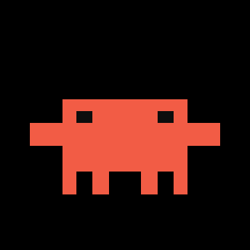

# my-first-website.

A looping pixel-art animation of **Clawd**, the little orange mascot, dancing on a black background.



## Files

| File | What it is |
| --- | --- |
| `clawd-dance.mp4` | 1080x1080, 30 fps, 12.8 s seamless loop with chiptune audio |
| `clawd-dance.gif` | 360x360 silent version for previews |
| `index.html` | Minimal page that plays the loop |
| `tools/generate_clawd_dance.py` | Generates every frame and the whole soundtrack from scratch |

## The animation

Eight bars at 150 BPM, choreographed so the last frame lands back on the first:

1. bouncy bob with alternating arm pumps
2. side-to-side stepping
3. fast arm wiggles
4. two tiny hops, then a big boing
5. a full spin, then more bobbing
6. mirrored stepping with wiggles
7. quick eighth-note shuffle
8. big hop and a closing spin back to neutral

Clawd's design is unchanged: a 12x8 grid of square pixels measured off the
reference art, body `#F25C45`, eyes `#0D0D0D`. Every frame is drawn on a
108x108 logical canvas and scaled up with nearest-neighbour, so the movement
stays snapped to the pixel grid.

## The sound

All audio is synthesised in plain Python -- no samples. Square-wave lead and
arpeggios, triangle bass, noise drums, plus effects timed to the dance:
boings on the big hops, whooshes on the spins, and blips on each step. The
tail is wrapped back into the head so the music loops seamlessly too.

## Rebuilding

```sh
pip install pillow imageio-ffmpeg
python3 tools/generate_clawd_dance.py build
```

Outputs land in `build/` (frames, `clawd-dance.wav`, `clawd-dance.mp4`, `clawd-dance.gif`).
