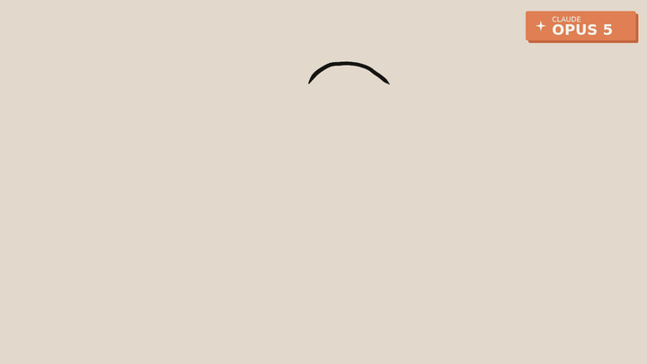

# my-first-website.

A hand-drawn line animation, in the style of the reference clip: brush-line
art on warm paper, a terracotta accent, and drawings that change 12 times a
second so the lines "boil" the way inked frames do.

Six seconds, looping:

1. a profile draws itself on, one unbroken line
2. a hand comes up to the chin — thinking
3. the head drifts off as a desk line opens into a screen
4. two hands type, and lines of writing appear
5. a spark, then a fade back to the start



## Watching it

Open `index.html` in a browser, or serve the folder:

```sh
npm start
```

## Rendering the video

Renders `dist/animation.mp4` (1280×720, 24 fps) and `dist/animation.gif`.
Needs Node, `ffmpeg` on `PATH`, and Chromium via Playwright.

```sh
npm install
npx playwright install chromium   # skip if Chromium is already available
npm run render
```

If `ffmpeg` or Chromium live somewhere unusual, point at them directly:

```sh
FFMPEG=/path/to/ffmpeg CHROMIUM_PATH=/path/to/chromium npm run render
```

## How it works

`assets/anim.js` is a small engine for drawing by hand, in about 400 lines.

Every drawing is a list of strokes, and every stroke is a handful of anchor
points. Those get splined, resampled to even spacing, then pushed sideways
along their own normals by seeded value noise — a slow wander for the wobble
of a hand plus a faster ripple for brush chatter. Painting a stroke means
walking it segment by segment with a round cap and a width that tapers at
both ends, so lines start and finish light.

Three things fall out of that setup for free:

- **Draw-on.** Render only the first *n* points of a stroke and taper at the
  moving tip, and the line appears to draw itself.
- **Boil.** The noise seed is the drawing step, so re-roughening every step
  makes the ink crawl the way real inked frames do.
- **Determinism.** `render(ctx, frame)` depends on nothing but the frame
  number, which is what lets `tools/render.mjs` step through frames in
  headless Chromium and hand them to ffmpeg.

The animation runs "on twos": 24 frames a second reach the video, but the
drawing only changes on every other one.

## Changing it

- **Timings** — the beat comments above `render()` in `assets/anim.js`, and
  the `seg(t, from, to)` windows in the body.
- **Colours** — the `C` object at the top.
- **Corner badge** — the `BADGE` object at the top; set it to whatever you
  want the animation labelled as.
- **Drawings** — `FACE_PROFILE`, `THINK_HAND`, `typingHand()`. They are just
  lists of `[x, y]` in a 1280×720 space. Anchors bunched close together give
  a sharp corner (the nose, the lips); spread out, they give a smooth curve.

## Layout

```
index.html         canvas, plus the playback loop
assets/anim.js     the engine and the drawings
tools/render.mjs   frames out of headless Chromium, into ffmpeg
dist/              the rendered mp4 and gif
```
