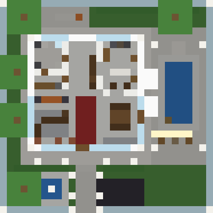
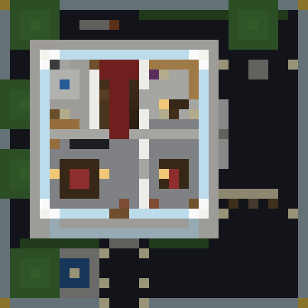
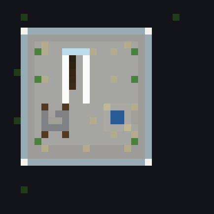

# Luxury House — Minecraft Bedrock addon (RP + BP)

A one-command luxury mansion for **Minecraft Bedrock Edition** (Android, iOS, Windows,
console). Stand anywhere on flat ground, type one command in chat, and a full 31×31
estate appears around you: two floors, four rooms upstairs, a swimming pool, a roof
terrace with a hot tub, gardens, a fountain and a lit driveway.

Made to be easy on a phone: no scripts, no mods, no PC needed — one file to tap, one
command to type.

| Ground floor | Upper floor | Roof terrace |
| --- | --- | --- |
|  |  |  |

## Install on a phone (1 minute)

1. Download **[`dist/LuxuryHouse.mcaddon`](dist/LuxuryHouse.mcaddon)** (tap the file, then
   the download button).
2. Tap the downloaded file. Minecraft opens and imports both packs automatically.
3. Create or edit a world → **Behaviour Packs** → activate **Luxury House**.
   The **Textures** resource pack is pulled in with it; if it is not on already, activate
   it under **Resource Packs** too.
4. In the same world settings, switch **Cheats / Activate Cheats** **ON**. Commands need it.
5. Play.

Prefer the packs separately? `dist/LuxuryHouse_BP.mcpack` and `dist/LuxuryHouse_RP.mcpack`
install one at a time the same way.

## Use it

Stand on flat, open ground, **face north**, and type in chat:

| Command | What it does |
| --- | --- |
| `/function lux/build` | Builds the whole mansion in front of you |
| `/function lux/clear` | Removes it again and flattens the plot |
| `/function lux/help` | Shows the commands in chat |

The estate is built **north of you**, with the pool on your **right**. It needs a 31×31
area and about 15 blocks of height. Anything already standing there is replaced, so build
on empty ground — or use `/function lux/clear` afterwards to put the land back.

On a phone the command is easiest to type once and then reuse: tap the chat button, and
Minecraft keeps your last commands in the history arrow.

## What you get

**Ground floor** — entrance hall with a red carpet runner, lounge with a fireplace and
corner sofa, kitchen with an island and bar stools, dining room, guest bathroom, utility
room, and a glass wall onto the pool terrace.

**Upper floor** — master bedroom with a double bed, dresser and wall-mounted screen, spa
bathroom with a jacuzzi, walk-in wardrobe, library/office with an enchanting table, guest
bedroom, and a balcony over the entrance.

**Roof terrace** — hot tub, pergola lounge, planters, glass railings, lit stair house.

**Grounds** — swimming pool with underwater lighting, diving board, sun loungers, parasols,
an outdoor bar, driveway, fountain, hedges, trees, lamp posts and a walled perimeter with a
gate.

Everything is built from vanilla blocks, so it works in survival worlds and stays light on
a phone — about 420 commands and 9,800 blocks, a second or two to build.

## Requirements

- Minecraft Bedrock Edition 1.21 or newer (Android, iOS, Windows 10/11, Xbox, PlayStation, Switch)
- Cheats enabled in the world
- Java Edition is **not** supported — it does not use behaviour/resource packs

## Repository layout

```
behavior_packs/luxury_house_bp/   the commands that build the house
resource_packs/luxury_house_rp/   marble textures for quartz blocks + pack icon
dist/                             the .mcaddon / .mcpack files you install
docs/                             floor plans rendered from the build itself
tools/                            the generators (see below)
```

## Building it yourself

The `.mcfunction` files are generated, not hand-written — edit `tools/build_functions.py`
(the house is described there in plain local coordinates) and run:

```bash
python3 tools/build_functions.py   # regenerate the mcfunction files
python3 tools/validate.py          # block ids, fill limits, function references
python3 tools/preview.py           # replay the build, draw floor plans, check every room is walkable
python3 tools/make_assets.py       # pack icons and marble textures
python3 tools/package.py           # rebuild dist/*.mcaddon and dist/*.mcpack
```

`preview.py` is the useful one: it replays every command into a virtual world, renders the
floor plans in `docs/`, and walks a virtual player from the front porch to check that all
16 rooms and outdoor areas can actually be reached. Only Python 3 is needed, no libraries.

## Troubleshooting

**"Unknown command" / nothing happens** — cheats are off for that world. Edit the world →
Game → Activate Cheats, then rejoin.

**The pack does not show up** — check the world's Behaviour Packs list; it is called
`Luxury House [Behaviour]`. If Minecraft never imported the file, move it into the
Downloads folder and tap it again.

**The house is built inside a hill** — the plot is cleared and flattened first, but very
steep terrain leaves a cliff face at the edges. Flat ground gives the best result.

**I want it somewhere else** — walk to the new spot and run `/function lux/build` again.
Run `/function lux/clear` first, standing where you built it, if you want the old one gone.

## Licence

MIT. Not an official Minecraft product. Not approved by or associated with Mojang or
Microsoft.
