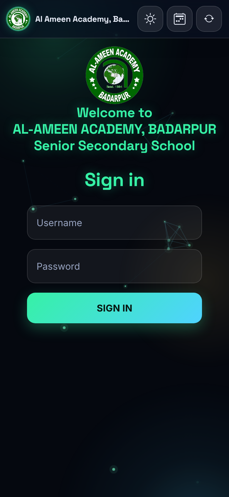
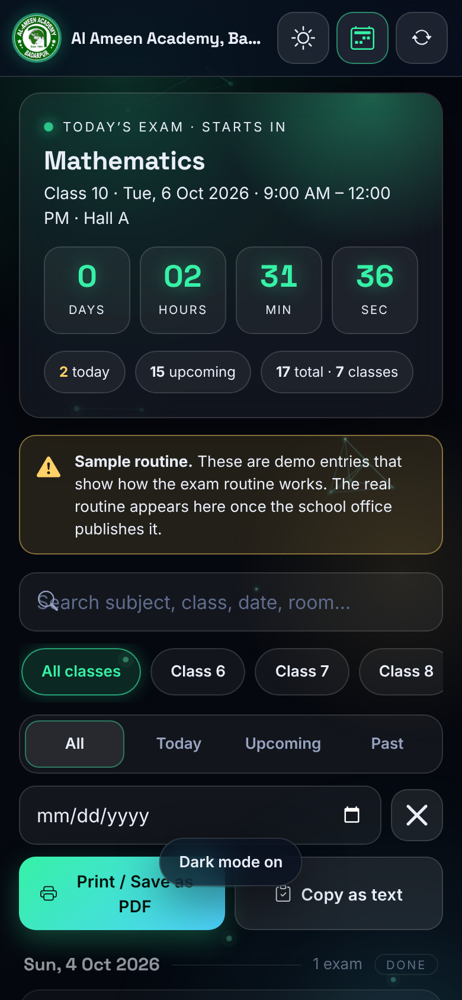
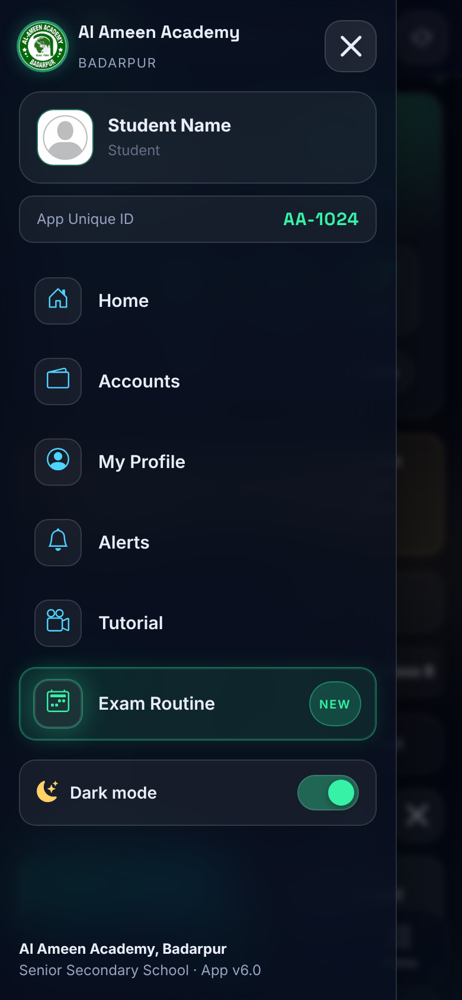

# Al Ameen Academy, Badarpur – school app

Official school app page and the Android build that wraps it.

- **Install the app:** download [`app/Alameen_Academy_Badarpur-6.0.apk`](app/Alameen_Academy_Badarpur-6.0.apk)
  on an Android phone (uninstall the old version first – see `CHANGES.md`).
- **The page itself:** [`index.html`](index.html) – one file with all HTML, CSS and JavaScript
  (dark/light theme, glass UI, animations, exam routine with search, filters, countdown and print).
  It can also be opened as a normal website; `assets/` holds the vendor files the ERP pages need.
- **What changed in v6.0:** [`CHANGES.md`](CHANGES.md)
- **Rebuilding / signing / updating the exam routine:** [`android/README.md`](android/README.md)

| Sign in (dark) | Exam routine | Menu |
| --- | --- | --- |
|  |  |  |
