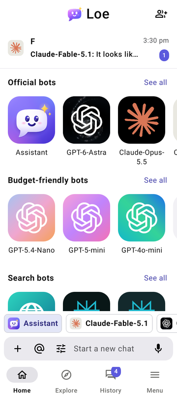
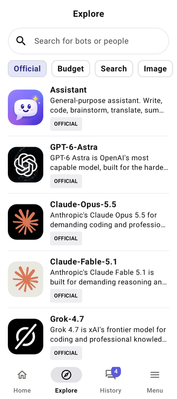
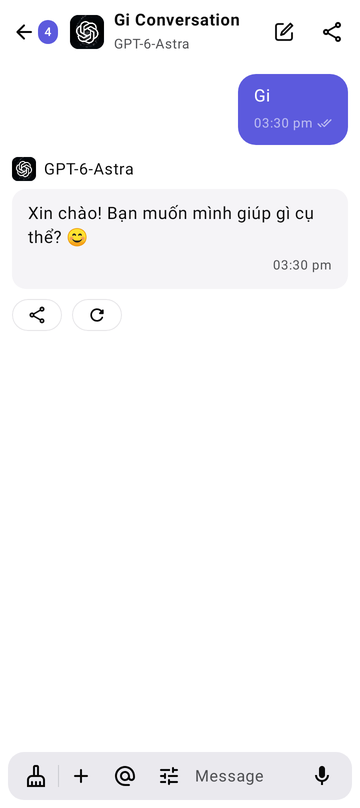
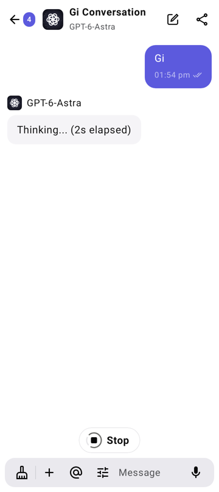
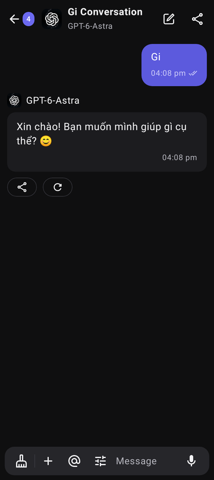

# Loe — AI chat app for Android

Loe puts GPT, Claude, Gemini, Grok, DeepSeek, Perplexity and image/video bots in one app, with the same
Home / Explore / History / Menu layout as the reference recording.

**Download:** [`Loe-v1.0.0.apk`](Loe-v1.0.0.apk) (3 MB, Android 8.0 or newer)

| Home | Explore | Chat | Thinking | Dark mode |
|---|---|---|---|---|
|  |  |  |  |  |

## Install

1. Download `Loe-v1.0.0.apk` on your phone and open it.
2. If Android asks, allow your browser or file manager to **install unknown apps**.
3. Open Loe, type your name and tap **Continue**.

## Connect an AI provider (needed to chat)

Loe has no server and no subscription. It talks to AI providers directly from your phone with **your own API key**.
Open **Menu → Settings → API keys** (or tap **Set up** on Home), add a key, and tap **Test**.

| Provider | What it unlocks | Get a key |
|---|---|---|
| **OpenRouter** (easiest) | Every bot in Loe with one key | https://openrouter.ai/keys |
| **Google Gemini** (free tier) | Assistant, Gemini and Nano-Banana bots | https://aistudio.google.com/apikey |
| Anthropic | Claude bots | https://console.anthropic.com/settings/keys |
| OpenAI | GPT bots, GPT-Image | https://platform.openai.com/api-keys |
| xAI | Grok | https://console.x.ai |
| DeepSeek | DeepSeek bots | https://platform.deepseek.com/api_keys |
| Poe API | Every bot, including Veo video, using your Poe points | https://poe.com/api_key |

When several keys could serve a bot, Loe uses the provider's own key first, then OpenRouter, then Poe.

## Features

- Home with your latest chat, Official / Budget-friendly / Search / Image / Video bot rows, bot chips and the "Start a new chat" box
- Explore with search and categories, History with search, rename and delete, unread badges
- Streaming replies with "Thinking… (Ns elapsed)", **Stop**, **Retry**, share, copy and select text
- `@mention` another bot mid-chat, the broom button to clear context, and chat options (answer length, custom instructions)
- Photos (for bots that can see images), text files and voice typing
- Image generation (GPT-Image-1.5, Nano-Banana, Nano-Banana-Pro) and video (Veo-3.1 with a Poe key)
- Create your own bots with a name, look, base model, prompt and greeting
- Compute points: a daily spending guard you control in Settings
- Light, dark and system themes, optional reply notifications
- Chats, bots, profile and keys stay on your phone

## Build from source

```bash
cd loe-android
./gradlew assembleRelease        # app/build/outputs/apk/release/app-release.apk
./gradlew testDebugUnitTest      # unit, engine (fake provider) and screenshot tests
./tools/verify-r8.sh             # checks the shrunk release build still talks to Claude
```

Needs JDK 17+ and the Android SDK (platform 36). Release signing reads `loe-android/keystore.properties`
(`storeFile`, `storePassword`, `keyAlias`, `keyPassword`); without it, release builds use the debug key.
The keystore is never committed.

Code map (`loe-android/app/src/main/java/com/loe/chat`):

- `data/`: bots catalog, providers, SQLite storage, settings
- `ai/`: Claude via the official Anthropic Java SDK, OpenAI-compatible streaming client, image APIs, routing
- `engine/`: sending, streaming, stop/retry, titles, unread counts, notifications
- `ui/`: Compose screens (home, explore, history, menu, chat, settings, profile, bots)
