# Block Blast (Flutter, Android)

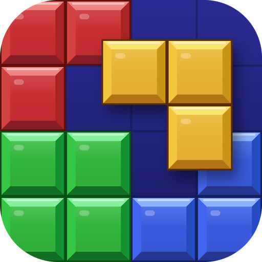

An 8x8 block puzzle game for Android in the style of the mobile game
*Block Blast*: drag pieces from the tray onto the board, fill whole rows or
columns to blast them, chain clears into combos and chase your best score.
Free to play with ads, or ad-free with **Premium** (more revives, hint
boosts and exclusive block skins) through Google Play subscriptions.

**Game Creator: IMRAN**

**Download:** [BlockBlast.apk (latest release)](https://github.com/lukmanhussen1990-cyber/my-first-website./releases/latest/download/BlockBlast.apk)
— signed release build, Android 8.0 (API 26) and newer, package
`com.myapps.blockblast`.

> Unofficial fan-made clone for learning purposes. Not affiliated with the
> makers of the original game. All graphics, sounds and music in this
> repository were created from scratch (drawn in code / synthesized).

## Screenshots

Version 1.0, captured on Android emulators from the signed release APK by
the device test bot:

| Splash | Studio | Logo | Game | Combo | Game over | Settings |
|---|---|---|---|---|---|---|
| 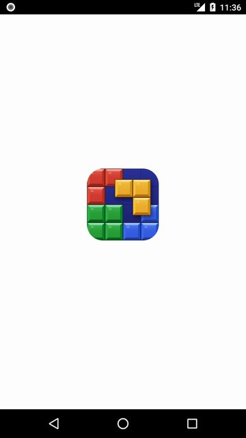 | 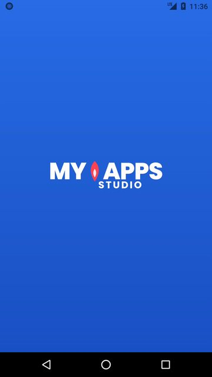 | 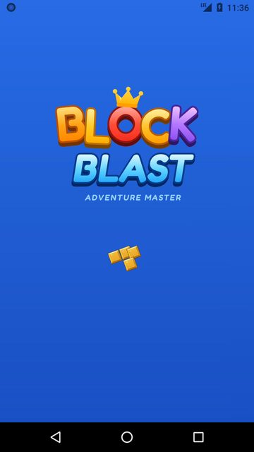 | 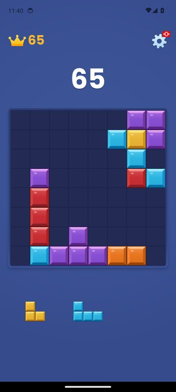 | 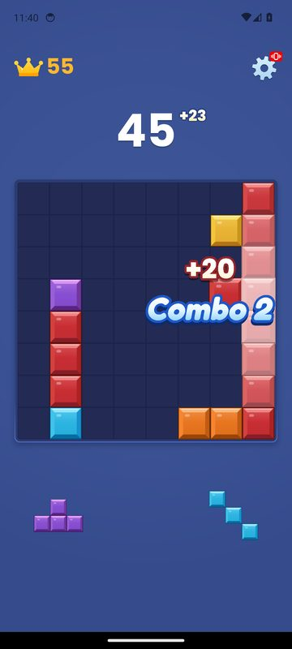 | 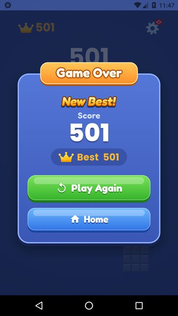 | 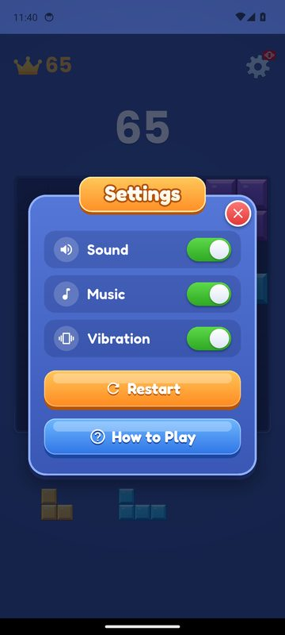 |

Version 1.1 (rendered from the same Dart code by the web visual QA):

| Home | Premium | Revive | Hint | Skins | Neon | Gem |
|---|---|---|---|---|---|---|
| 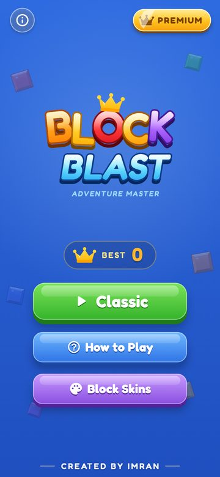 | 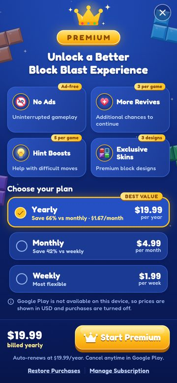 | 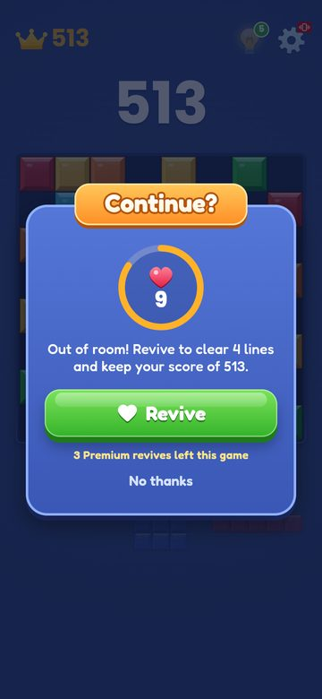 | 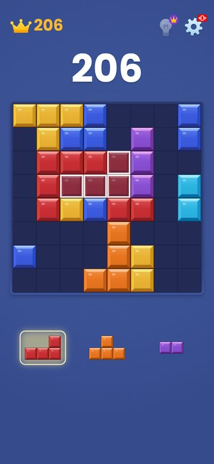 | 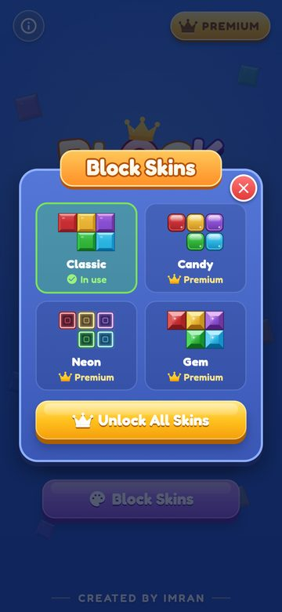 | 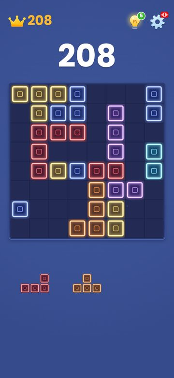 | 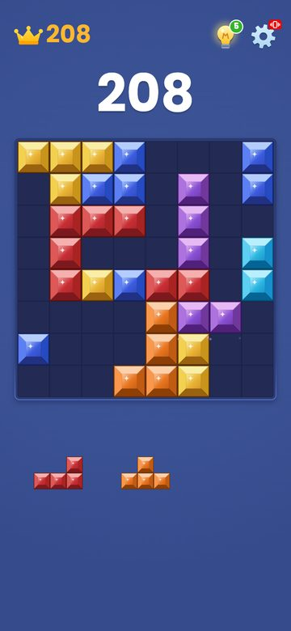 |

## Features

- **Screens:** white icon splash → blue splash with a studio logo and the
  bubbly BLOCK BLAST logo (crown on the "O", animated yellow loading blocks)
  → home screen → game. Game-over popup with *Play Again* / *Home*,
  settings, how-to-play, skins and About popups.
- **Home screen:** animated logo and floating blocks, BEST badge,
  *Continue* (resumes the saved game) / *How to Play* / *Block Skins*,
  About (top left), a gold crown **PREMIUM** button (top right) and
  "CREATED BY IMRAN" at the bottom.
- **Premium:** subscription screen with a 2×2 benefit grid (No Ads, More
  Revives, Hint Boosts, Exclusive Skins), Yearly (Best Value) / Monthly /
  Weekly plans with localized Google Play prices and computed savings, the
  selected plan's charge and billing period next to *Start Premium*,
  Restore Purchases, Manage Subscription and renewal terms. Purchases are
  verified (Google Play signature + purchase data) before anything
  unlocks. See [docs/MONETIZATION.md](docs/MONETIZATION.md).
- **Benefits:** free players get a banner, a paced interstitial between
  games, 1 hint and 1 ad-funded revive per game; Premium removes all ads
  and gives 5 hints, 3 instant revives per game and the Candy, Neon and Gem
  block skins. Revives empty the two fullest rows and columns; hints show
  the best move from a built-in solver.
- **Gameplay:** 8x8 board, three tray pieces, drag & drop with a lifted
  full-size piece above the finger, ghost preview, lines that would clear
  glow in the piece color, invalid drops fly back to the tray, new set of
  three after all are used, game over when nothing fits (tray pieces that do
  not fit are dimmed).
- **Pieces:** 1x1; 1x2–1x5 lines (both orientations); 2x2 and 3x3 squares;
  2x3 / 3x2 rectangles; L and J tetrominoes and big 3x3 L corners (4
  rotations); T (4 rotations); S and Z (both orientations); 3-cell corners
  (4 rotations); 2- and 3-cell diagonals. Seven colors. The generator is
  "fair": it prefers sets that can all be placed on the current board.
- **Scoring:** +1 per placed cell; lines cleared in one move: 1 → 10,
  2 → 30, 3 → 60, 4 → 100, 5 → 150 … (10 × n(n+1)/2); clearing on
  consecutive moves builds a combo that multiplies the line bonus
  ("Combo 2", "Combo 3", …). Floating "+N" texts, praise labels
  (Good / Great / Excellent / Amazing / Unbelievable), score count-up,
  live best score with a gem behind the score when the record is beaten.
- **Effects & feel:** glossy beveled 3D blocks, white flash + particle burst
  wave on line clears, glowing line beams, a short shake on big clears,
  piece "pop" with a white flash and dust on landing, fast piece pickup,
  gray sweep at game over, zoom/slide screen transitions. Sound effects
  (pick up, drop, line clear, combo, game over, new best), background
  music, haptics on landing, clears and game over.
- **Persistence:** best score, settings (sound, music, vibration), the
  chosen skin and the game in progress are saved on the device (the game
  resumes after restart; saves from 1.0 still load).
- Portrait only; the layout scales with the screen width (and shrinks on
  short screens).

## Build the signed release APK

Requirements: Flutter 3.47+ (stable), Android SDK (platform 36,
build-tools 36), JDK 17+.

1. Create a release keystore (once):

   ```bash
   keytool -genkeypair -v -keystore ~/keys/blockblast-release.jks -storetype PKCS12 \
     -alias blockblast -keyalg RSA -keysize 2048 -validity 10000
   ```

2. Create `android/key.properties` (it is git-ignored, never commit it):

   ```properties
   storePassword=<your store password>
   keyPassword=<your key password>
   keyAlias=blockblast
   storeFile=/absolute/path/to/blockblast-release.jks
   ```

3. Build:

   ```bash
   flutter pub get
   flutter build apk --release
   # -> build/app/outputs/flutter-apk/app-release.apk
   ```

For real purchases and ads, add your Play license key and AdMob IDs as
described in [docs/MONETIZATION.md](docs/MONETIZATION.md); without them
the build shows test ads and cannot sell subscriptions.

The release build type is always signed with this key; without
`android/key.properties` the release build fails instead of falling back to
debug keys. Install on a phone with `adb install app-release.apk` or by
opening the file on the device.

To publish a new download: copy the APK to `release/BlockBlast.apk` and
push. The *Publish APK release* workflow attaches it to the GitHub Release
`v<version from pubspec.yaml>`.

## Tests

```bash
flutter test            # unit + widget tests
flutter analyze
```

- `test/logic_test.dart` – placement validation, line clearing (incl.
  row/column intersections), scoring table, combo multiplier and reset,
  tray refill, game-over detection, fair generator, random full games,
  save/restore.
- `test/game_screen_test.dart` – real drag gestures on the game screen:
  placement, invalid drop, tap-without-drag, two-line clear, game-over
  popup, settings toggles/restart, and that an idle screen stops
  rendering frames (battery).
- `test/screens_test.dart` – splash sequence, home, how-to-play, game-over
  popup, beating the best score, full-screen backgrounds, popups on a
  320x480 screen (paints every screen on the native test engine).
- `test/oracle_test.dart` – 60 random games (>1000 moves) checked move by
  move against an independently written rules model (cells, lines, points,
  combo, game over).
- `test/layout_test.dart` – board, header and the largest tray pieces fit
  without overlap on 15 screen sizes from 320x480 to tablets.
- `test/plans_test.dart` – billing periods, savings percentages (rounded
  down, same currency only) and per-period equivalents (rounded up, incl.
  currencies without cents).
- `test/premium_service_test.dart` – purchases with a fake Google Play:
  localized prices, verified purchases unlock and are acknowledged, forged
  or unverifiable ones never unlock, pending payments, cancel, restore,
  expiry, offline cache with a time limit, tampered cache, plan switching.
- `test/benefits_logic_test.dart` – revive (fullest lines, score kept,
  always playable afterwards), hint solver (legal, prefers clears, fast),
  1.0 saves still loading.
- `test/premium_ui_test.dart` – Premium screen (benefits, plans, savings,
  charge beside the button, purchase flow, close), home screen (PREMIUM
  top right, creator credit, About), layouts on phones and tablets,
  screen-reader actions, hints/revives/skins on the game screen and the
  banner space for free players.
- `android/app/src/test` – JVM tests of the purchase signature check
  (`./gradlew :app:testDebugUnitTest` in `android/`).
- **On-device:** the *Device test* workflow installs the signed APK on
  Android 8.0 (API 26) and Android 14 (API 34) emulators and runs
  `tool/device_bot.py`, a bot that reads the board from screenshots and
  plays full games through `adb` (drag & drop, clears, scoring checks via
  logcat markers, revive offer, game over, settings, save/restore, hint,
  home, Premium and About screens). Run it locally with an emulator
  attached: `tool/device_test.sh out_dir`.
- **Visual QA:** `flutter build web --release --no-web-resources-cdn`,
  serve `build/web` and run `node tool/web_qa.js http://localhost:8090/ qa`
  (Playwright) to capture screenshots of every screen and effect. The web
  build supports `?game&scenario=demo|clear|combo|over` for deterministic
  scenes, `?screen=home|premium`, `?premium=1` (simulated subscription)
  and `?skin=candy|neon|gem`; these debug options are disabled on Android.

## Known limitations

- Tested on Android 8.0 and Android 14 emulators (x86_64) through the
  device-test bot, not on a physical phone; sound playback and vibration
  were verified through the Android logs only (emulators have no speaker
  output or vibrator to observe).
- Fonts are free look-alikes (Fredoka, Poppins) of the original game's
  fonts; the studio logo is a neutral "MY APPS STUDIO" placeholder.
- Combos follow the requested rule (clears on *consecutive* moves); a move
  without a clear resets the combo.
- Subscriptions and live ads need your own Google Play Console and AdMob
  setup ([docs/MONETIZATION.md](docs/MONETIZATION.md)); until then the
  Premium screen shows reference USD prices with purchasing turned off,
  and free players see Google's test ads. Purchases are verified on the
  device; server-side verification is recommended for stronger
  protection.
- No adventure mode or online features.

## Project layout

```
lib/
  main.dart                    app entry (portrait lock, error hooks)
  src/logic/                   pure game model (board, shapes, scoring, game state, revive, hint solver)
  src/game/                    game screen: layout, controller (drag, animations), painter
  src/premium/                 plans & savings math, Google Play store, verification, Premium service
  src/screens/                 splash, home, Premium screens, transitions
  src/widgets/                 logo, popups (settings, revive, skins, About), candy buttons/toggles
  src/ui/                      palette, block sprites and skins, icons, text effects
  src/services/                settings/best/saved game, sound, haptics, ads
android/                       Android project (signing, vibration + purchase-signature channels)
assets/                        fonts (OFL) and generated sounds
tool/                          generators (icons, sounds) and test drivers
```

Regenerate assets: `python3 tool/gen_icons.py` (needs Pillow) and
`python3 tool/gen_sounds.py` (needs numpy + ffmpeg).

## Credits

- Game Creator: **IMRAN**
- Fonts: [Fredoka](https://fonts.google.com/specimen/Fredoka) and
  [Poppins](https://fonts.google.com/specimen/Poppins), SIL Open Font License
  (see `assets/fonts/OFL-*.txt`).
- Everything else (graphics, icon, sounds, music) is original and generated
  by the scripts in `tool/`.
