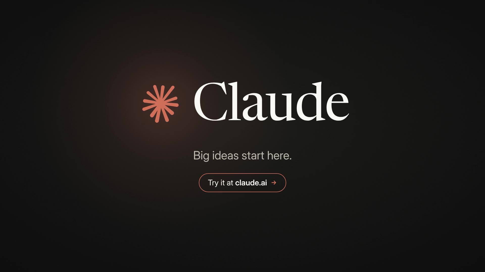

# Claude — 10-second promo



**[claude-promo.mp4](claude-promo.mp4)** — 1920×1080, 60 fps, 10.0 s, H.264 + AAC stereo (−14 LUFS), ~5 MB.

A motion-graphics spot in Claude's warm palette (ivory, slate, terracotta), with a soundtrack synced to the picture.

| Time | Scene |
| --- | --- |
| 0.0 – 1.0 s | A spark ignites in the dark, bursts into rays, and the camera dives into its core. |
| 1.0 – 3.0 s | Four beats, four words: **Write. Code. Analyze. Create.**, each with its own micro-animation. |
| 3.0 – 7.0 s | Product moment: "What's the big idea?" → a prompt is typed and sent → Claude thinks and answers with a three-step launch plan. |
| 7.0 – 8.0 s | Claude's spark flies out of the chat and an iris wipe takes us to the end card. |
| 8.0 – 10.0 s | Lockup: spark + **Claude**, "Big ideas start here." and a *Try it at claude.ai* call to action. |

## How it's made

Everything is code; nothing is drawn by hand or sampled.

- `src/ad.html`: the animation. Every frame is a pure function of time (`window.renderFrame(t)`), built from HTML, SVG and CSS.
  Open it in a browser with `?play` to watch it loop, or with `?t=5.6` to freeze on a moment.
- `src/render.js`: drives headless Chromium through Playwright and screenshots each frame.
- `src/music.py`: synthesises the 120 BPM soundtrack with numpy (pads, plucks, bells, drums, risers, typing clicks).
  Each hit lands on a cue time exported from `ad.html`, so the sound stays locked to the picture.
- `build.sh`: runs all of the above and encodes the MP4.

```bash
./build.sh            # needs node + playwright, python3 + numpy, ffmpeg
```

Fonts: [Newsreader](https://github.com/productiontype/Newsreader) and [Inter](https://github.com/rsms/inter), both under the SIL Open Font License (see `src/fonts/`).

> This is an unofficial concept piece. "Claude" is a trademark of Anthropic, and the spark here is an original homage, not the official logo.
