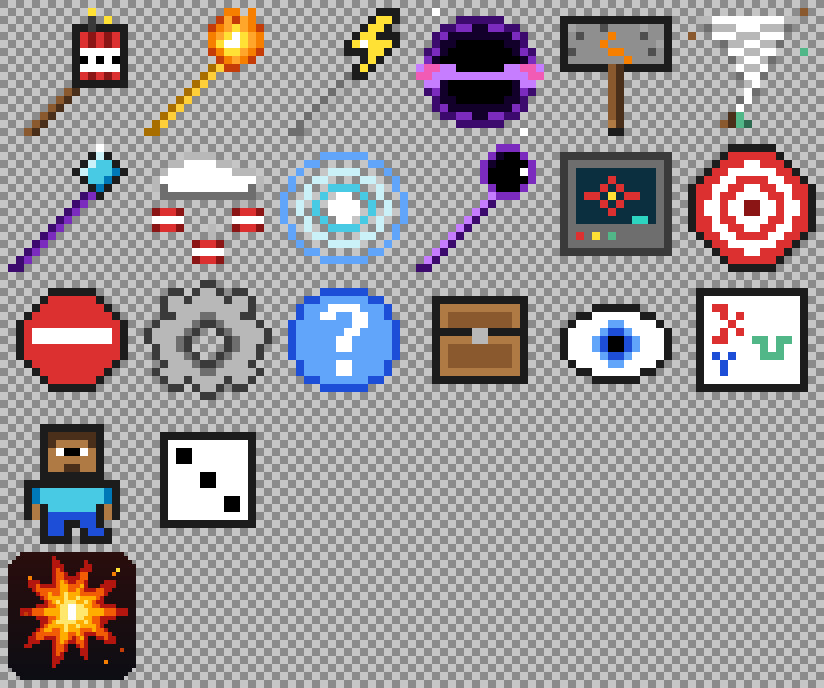

# Destruction Mod (Minecraft Bedrock add-on)

10 destruction weapons for Minecraft Bedrock / Pocket Edition. You choose **where** each one hits:
where you're looking, a saved marker, typed coordinates, another player, or a random spot.

- Made for **1.21.0.26 (beta/preview) on Android**. It works on 1.20.80 and newer.
- **No experimental toggles needed.** It uses only the stable script API (`@minecraft/server` 1.10.0, `@minecraft/server-ui` 1.1.0).
- One file: [`dist/DestructionMod.mcaddon`](dist/DestructionMod.mcaddon)



## Install on your phone

1. Download **[DestructionMod.mcaddon](https://github.com/lukmanhussen1990-cyber/my-first-website./raw/ccr-9821cf9b-nhcm5c/destruction-mod/dist/DestructionMod.mcaddon)**.
2. Tap the downloaded file and choose **Minecraft**. Wait for "Successfully imported".
   If your phone won't open `.mcaddon` files, import `dist/DestructionMod_BP.mcpack` and then `dist/DestructionMod_RP.mcpack` the same way.
3. In Minecraft, **create a world** (or edit one), open **Behavior Packs**, and activate **Destruction Mod**. The textures pack gets added automatically.
4. Play. The first time you join, all 12 items go into your inventory.

Worlds with add-ons turn off achievements. That's normal.

## Controls

| Action | What happens |
|---|---|
| **Tap** with a weapon | Strikes where the weapon is set to hit (default: the block you're looking at) |
| **Sneak + tap** with a weapon | Choose **where** it hits and its **power** (1-5) |
| **Tap** with the Destruction Tablet | Full menu: launch strikes, settings, get all weapons, **STOP ALL** |
| **Tap** a block with the Target Marker | Saves that spot as your marker. Sneak + tap clears it |

While you hold a weapon, the text above your hotbar shows exactly where it will hit, and green sparkles mark the spot.

## The 6+ weapons (10 in total)

| Item | What it does |
|---|---|
| Mega TNT Wand | Huge blast, then a ring of explosions and a deep charge |
| Meteor Staff | Flaming meteors fall from the sky and leave hot magma rocks in their craters |
| Thunder Staff | A lightning storm around the target |
| Black Hole Orb | Pulls mobs and items in and eats the ground, then collapses with a blast |
| Earthquake Hammer | Cracks rip through the ground and bounce mobs around. Power 4-5 splits it open to lava |
| Tornado Wand | A wandering tornado that flings mobs and strips the land |
| Sky Beam Staff | A beam from the sky drills a deep pit and sets the rim on fire |
| TNT Rain Wand | Lit TNT rains down on the target |
| Shockwave Core | Rings of force blast outward, knocking everything back |
| Crater Wand | Erases a perfect ball of terrain (great for digging) |

Plus the **Destruction Tablet** (menu) and the **Target Marker**.

## Choose where it hits

Set this per weapon (sneak + tap it) or in the tablet's **Launch a Strike** menu:

- **Where I'm looking**: the block under your crosshair (range is set in Game Settings, 32-256 blocks)
- **My Target Marker**: the spot you saved with the Target Marker
- **Type coordinates**: X Y Z. `~` means your position and `~10` means 10 blocks from you. A point in the air drops to the ground.
- **On a player**: pick anyone who is online
- **Random spot near me**: 14-36 blocks away

## Game Settings (tablet)

- **Block damage** off: everything still looks and sounds the same, but no blocks break
- **Fire** on/off
- **Protect me** (on by default): you get Resistance V + Fire Resistance while your strike runs, and your own tornadoes, black holes and shockwaves won't pull or push you
- **Aim range**

Bedrock, command blocks, barriers, portals and the Nether roof are never removed.

## Crafting (survival)

| Item | Recipe (3x3, top row first) |
|---|---|
| Mega TNT Wand | TNT TNT TNT / TNT Diamond TNT / _ Blaze Rod _ |
| Meteor Staff | Magma Block, Fire Charge, Magma Block / _ Blaze Rod _ / _ Blaze Rod _ |
| Thunder Staff | Copper Ingot, Lightning Rod, Copper Ingot / _ Iron Ingot _ / _ Iron Ingot _ |
| Black Hole Orb | Crying Obsidian, Ender Pearl, Crying Obsidian / Ender Pearl, Echo Shard, Ender Pearl / Crying Obsidian, Ender Pearl, Crying Obsidian |
| Earthquake Hammer | Iron Block x3 / Iron Block, Anvil, Iron Block / _ Stick _ |
| Tornado Wand | Wind Charge x3 / _ Breeze Rod _ / _ Breeze Rod _ |
| Sky Beam Staff | End Rod, End Crystal, End Rod / _ Blaze Rod _ / _ Blaze Rod _ |
| TNT Rain Wand | TNT, Phantom Membrane, TNT / _ Blaze Rod _ / _ Blaze Rod _ |
| Shockwave Core | Amethyst Shard x3 / Amethyst Shard, TNT, Amethyst Shard / Amethyst Shard x3 |
| Crater Wand | Ender Pearl, Eye of Ender, Ender Pearl / _ Obsidian _ / _ Obsidian _ |
| Destruction Tablet | Iron Ingot, Redstone, Iron Ingot / Iron Ingot, Glass Pane, Iron Ingot / Iron Ingot x3 |
| Target Marker | _ Redstone Torch _ / _ Stick _ / _ Stick _ |

## Commands (cheats on)

- `/function destruct/kit`: give yourself every item
- `/function destruct/menu`: open the tablet menu
- `/function destruct/stop`: stop all running destruction

## Tips

- Power 5 is big. On phones, start with power 3.
- The world has to be loaded where the strike lands. Very far coordinates are refused with a message.
- Up to 12 strikes can run at the same time. Use **STOP ALL** if things get out of hand.

## For developers

```
npm install        # type definitions for the exact script API versions
npm run check      # strict TypeScript check of the scripts
npm test           # smoke test: runs every weapon, menu and target mode in a mock world
npm run build      # regenerates JSON + textures, validates every ID, builds dist/
```

`tools/vanilla_ids_1.21.0.26.json` lists the particle, sound, block, item, entity and effect IDs from vanilla 1.21.0.26. The build fails if a script uses an ID that isn't on that list.
