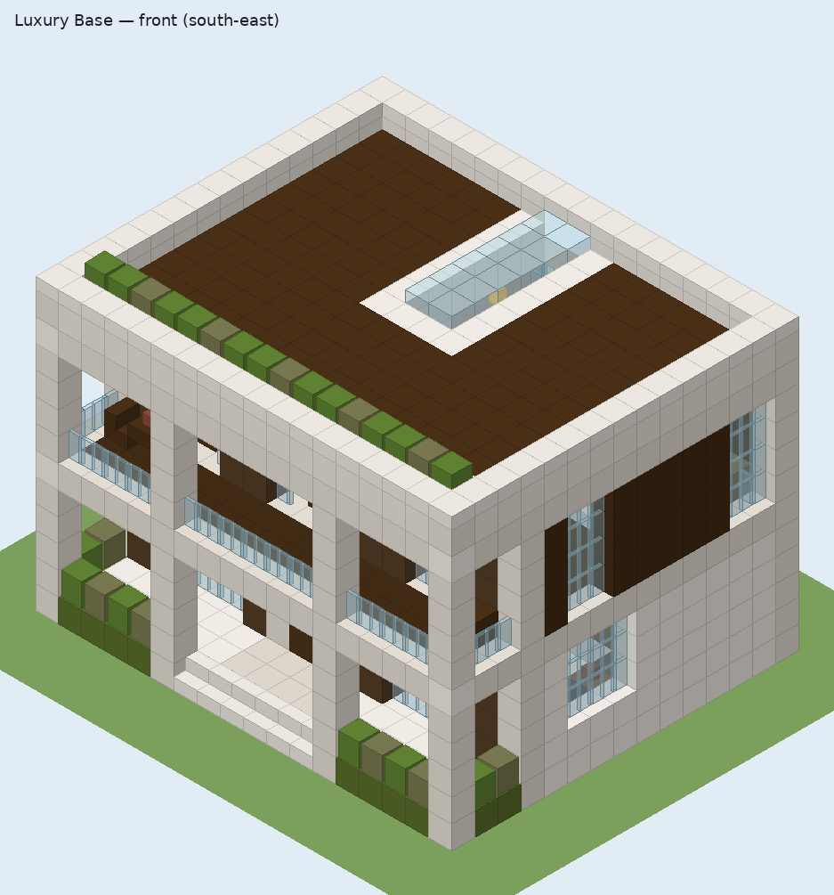
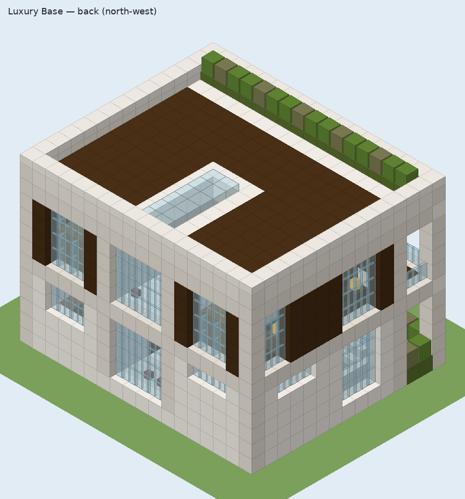
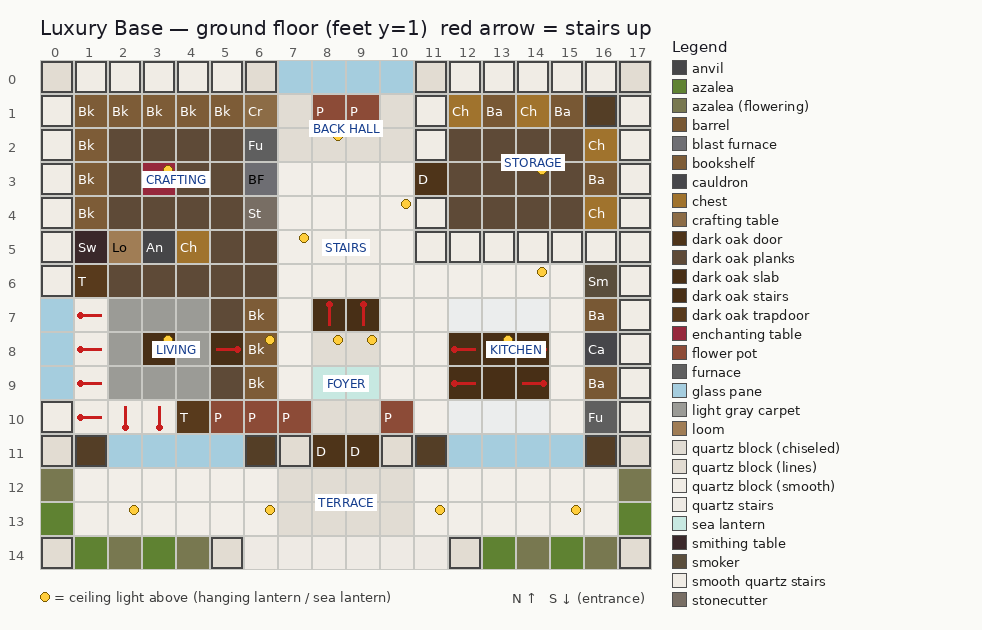
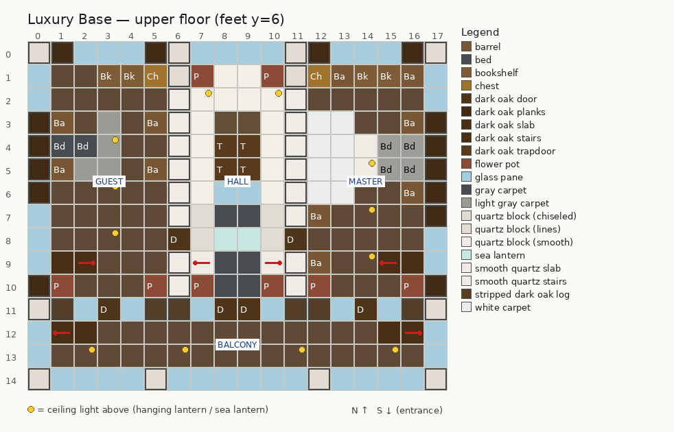
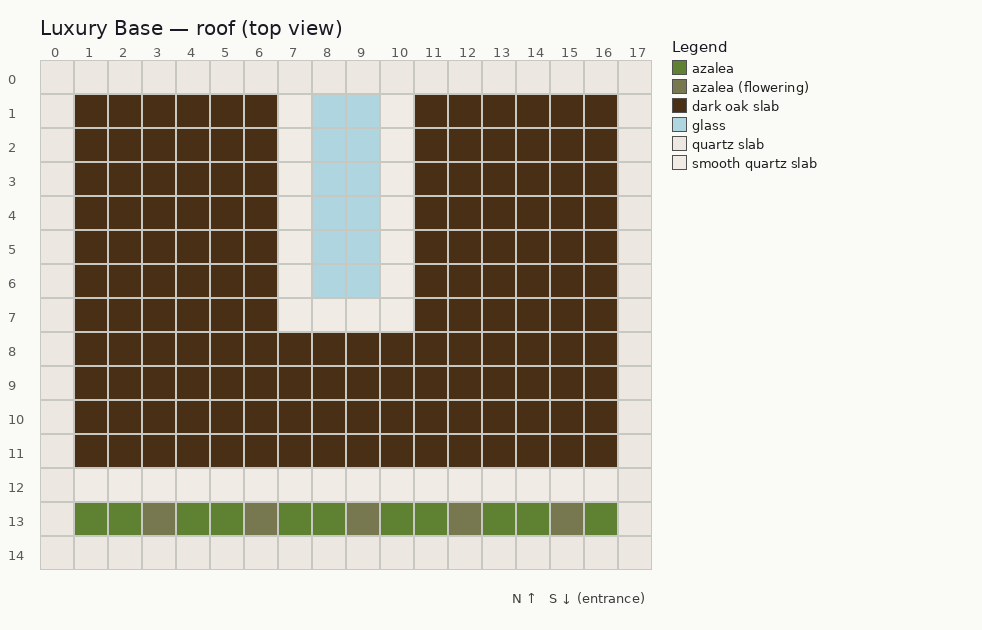

# Luxury Base — structure design and generator

The **Luxury Base** is a modern two-storey villa in white quartz and dark oak, with
floor-to-ceiling glass, a full-width double loggia (covered terrace plus balcony) and a
green roof edge. It is generated by `tools/house/blueprint.py` and placed by the house
script (`scripts/house/`, SPEC §6) from `structures/pas/luxury_base.mcstructure`.

| Front (south-east) | Back (north-west) |
|---|---|
|  |  |

| Ground floor | Upper floor | Roof |
|---|---|---|
|  |  |  |

On the plans, red arrows mark the direction a stair rises (for sofas and chairs, the arrow points at the
backrest). Yellow dots are ceiling lights above the walking level. Cells with a heavy outline are walls.

## Files

| file | role |
|---|---|
| `tools/house/blueprint.py` | procedural builder. It writes the structure, `blueprint_meta.js` and the PNGs (`--no-images` skips the PNGs) |
| `tools/house/blocks.py` | block-state constructors. Every block gets the **full** state set from `mojang-blocks.json` (validated), plus the orientation helpers below |
| `tools/house/nbt_le.py` | little-endian NBT writer (explicitly typed tags) |
| `tools/house/render.py` | plan and isometric voxel renderer (PIL; colours only, no game textures) |
| `tools/house/validate_structure.py` | **independent** validator. It does not import the writer |
| `tools/house/test_house.py` | unit tests (semantics read from the PocketMine PHP, NBT round trip, ZYX order, mutation tests of the validator) |
| `addon/behavior_pack/structures/pas/luxury_base.mcstructure` | output, about 42 KB |
| `addon/behavior_pack/scripts/house/blueprint_meta.js` | output: the `HOUSE` contract for the script |

```
python3 tools/house/blueprint.py                 # regenerate everything
python3 tools/house/validate_structure.py        # must print PASS (exit 0); --json for machine output
python3 -m unittest discover -s tools/house -p 'test_*.py' -v
```
The scripts find the reference data through `PAS_VANILLA_REF` (default: the scratch `bedrock-samples-1.21.0.26` path from SPEC §0).
The validator also cross-checks against PocketMine's BedrockData `canonical_block_states.nbt` (1.21.0) when it is
present next to it (`--canonical PATH`). If it is missing, that check is skipped.

## Geometry and contract

Box **18 × 13 × 15** (x × y × z). The limits are a 19 × 15 footprint and a height of 14. Canonical orientation: +x east, +z south, entrance **south**.

| local y | content |
|---|---|
| 0 | foundation. The house floor sits **on top of** the terrain, so the floor is one block above the ground |
| 1–4 | ground floor. Feet level is y = 1 = `HOUSE.floorY` |
| 5 | ground-floor ceiling and upper floor (stairwell open at x 8–9, z 4–6) |
| 6–9 | upper floor (feet y = 6) |
| 10 | roof deck and canopy |
| 11–12 | roof slabs, parapet, skylight and green roof edge (y 12 inside the parapet is structure void) |

```js
HOUSE = { structureId: "pas:luxury_base", size: {x:18,y:13,z:15}, entrance: {x:9,y:1,z:12},
          entranceSide: "south", floorY: 1, supportRatio: 0.8, buildSeconds: 7, probeCell: {x:1,y:4,z:6} }
```
* `entrance` is the terrace cell in front of the east leaf of the double door. y is the **feet** level. The double
  door occupies x 8–9 at z 11, so its centre (x 8.5) is exactly the centre of the 18-wide box.
* The terrace (z 12–13) and the front steps (z 14, the outermost row on the entrance side) are part of the box. When the
  script picks an origin, the player must stand south of z 14.
* `probeCell` is an air cell in the living room under the ceiling.
* Every footprint cell has a block at y 0 (foundation, terrace, steps or planters). Only 192 cells, all at y 12 inside the parapet, are void (`-1`).

## Rooms (all furnished and lit)

**Ground floor (feet y 1)**
* **Foyer** (x 7–10, z 8–10): chiseled quartz floor with two sea-lantern floor tiles, potted azaleas, and the double front door.
* **Staircase** (x 8–9, z 7 → 3): two-wide dark oak stairs rising north from y 1 to y 5. Upside-down smooth quartz stairs
  underneath form a solid soffit. The stairwell is open over steps 1–3 so the head clears every step-up. Walking upward
  reaches a back landing at z 1–2.
* **Living room** (x 1–6, z 6–10): L-shaped smooth-quartz sofa with dark oak armrest panels, a light gray rug, a coffee table
  with a lantern, a two-high bookshelf media wall with a lamp and ferns, a reading chair, potted tulip and azalea, a pendant lantern,
  and a floor-to-ceiling glass wall on the south and west.
* **Crafting room** (x 1–6, z 1–5): enchanting table at (3,1,3) with 16 effective bookshelves (an L of shelves, 3 high,
  2 blocks away, with a clear ring between). Also a crafting table, furnace, blast furnace, stonecutter, smithing table, loom
  and anvil, a chest of enchanting supplies (lapis, bottles o' enchanting, books, iron, coal), and a pendant lantern.
* **Kitchen and dining** (x 11–16, z 6–10): counter along the east wall (smoker, barrel, water-cauldron sink, barrel,
  furnace), upper barrel cabinets with open trapdoor doors, a window over the counter, a dining table with four chairs, a table lamp, flowers,
  white runners and a pendant over the table.
* **Storage** (x 12–16, z 1–4, door at x 11): 4 chests (food, building materials, farming/misc, food and torches)
  alternating with barrels, a second tier of barrels, a corner lamp post and a hanging lantern.
* **Back hall** (x 7–10, z 1–2): links the crafting room and the storage door. It has a double-height glass wall and azalea pots.
* **Terrace / loggia** (z 12–13, full width): covered by the balcony. It has quartz pillars, moss-and-azalea planters, lanterns and quartz front steps.

**Upper floor (feet y 6)**
* **Hall / gallery** (x 7–10, z 1–10): landing with pendants, side walkways around the stairwell (glass railing
  at z 6, thin open-trapdoor panels at z 4–5), a lounge with two armchairs and a rug, and two sea-lantern floor
  tiles. Glass French doors lead to the balcony, and a skylight runs above the stairs.
* **Master bedroom** (x 12–16, door at x 11): two beds side by side (light gray), headboard panels, two barrel
  nightstands with lamps, a quartz bench at the foot of the beds, a white rug, wardrobe barrels, a chest, bookshelves,
  a desk with chair and lamp, plants, a pendant, a flush ceiling light, and its own balcony door.
* **Guest bedroom** (x 1–5, door at x 6): one bed (gray), headboard, two nightstands (lamp and lily pot), wardrobe
  barrels, a rug, a chest, bookshelves, a desk with chair and lamp, plants, pendants, a ceiling light, and its own balcony door.
* **Balcony** (z 12–13, full width): glass railing between quartz pillars. It has two lounge corners (chair, side table and
  flower) and lanterns under the canopy. It is reachable through 4 doors (2 French doors and 2 bedroom doors).

Doors: 9 in total. The front double door has mirrored hinges. Inside there are 3 interior doors (storage, guest, master) and 4 balcony doors.

## Materials

Quartz: `quartz_block` with chisel_type smooth, default, lines (pillars with axis x/y/z) and chiseled; `quartz_slab`;
`stone_block_slab4` with `stone_slab_type_4=smooth_quartz` (in 1.21.0.26 the smooth quartz slab is still this block);
`quartz_stairs`; `smooth_quartz_stairs`.
Dark oak: `dark_oak_planks` (upper-storey cladding, floors), `stripped_dark_oak_log` (mullions, posts),
`dark_oak_slab` (roof deck, tables), `dark_oak_stairs`, `dark_oak_trapdoor`, `dark_oak_door`.
Glass: `glass_pane` (walls, railings), `glass` (skylight).
Accents: `lantern`, `sea_lantern`, `bookshelf`, `moss_block` + `azalea` / `flowering_azalea`, `flower_pot` (plant in the
block entity), carpets (light gray, white, gray), and beds (light gray / gray).
All 72 palette entries are canonical 1.21.0 states, cross-checked against PocketMine BedrockData `canonical_block_states.nbt`.

## .mcstructure format (verified)

* Root compound (empty name): `format_version` Int 1, `size` List<Int>[3], `structure` {`block_indices`: List of
  two List<Int>, `entities`: empty List<Compound>, `palette`: {`default`: {`block_palette`: List<Compound{name String,
  states Compound, version Int}>, `block_position_data`: Compound{"<flat index>": {`block_entity_data`: Compound}}}}},
  `structure_world_origin` List<Int>[3] = 0,0,0. Little-endian, uncompressed.
* **Flat index = (x·size_y + y)·size_z + z** (z varies fastest, then y, then x). Sources:
  Bedrock-OSS wiki `docs/nbt/mcstructure.md` (raw.githubusercontent.com/Bedrock-OSS/bedrock-wiki/wiki/docs/nbt/mcstructure.md:
  "Each sublist proceeds in ZYX order", worked 2×3×4 example) and tryashtar's original gist
  (gist.github.com/tryashtar/87ad9654305e5df686acab05cc4b6205: "To convert from coordinates to index: `SZ*SY*X + SZ*Y + Z`").
  `test_flat_index_order_zyx` re-reads the file with nbtlib and checks it.
* `-1` = structure void (existing world block kept), which is what the game writes for saved structure voids. The second
  layer is all `-1` (nothing is waterlogged). Explicit `minecraft:air` clears the interior, terrace and balcony volume.
* State tag types: bool → Byte, int → Int, string → String (both sources above, plus PocketMine's canonical states,
  where the validator compares the tag types too). Palette `version` is Int **18153475** = (1<<24)|(21<<16)|(0<<8)|3,
  PocketMine `BlockStateData::CURRENT_VERSION` (src/data/bedrock/block/BlockStateData.php:42).

### Block entity NBT

Following PocketMine 5.16.0 (`src/block/tile/*`) plus the Bedrock 1.21-era base fields:

| block | block_entity_data |
|---|---|
| every one | `id` String, `isMovable` Byte 1, `x`/`y`/`z` Int = local position (the game replaces them on load). `id`/`x`/`y`/`z`: Tile.php:44 and Spawnable::getSpawnCompound. `isMovable`: minecraft.wiki "Bedrock Edition level format/Block entity format" revision 2601396 (2024-06-14). PocketMine itself does not write `isMovable` or `Findable` |
| bed (both halves) | `id` "Bed" (TileFactory.php:56), `color` Byte (tile/Bed.php:32,56; DyeColorIdMap: gray 7, light_gray 8) |
| chest | `id` "Chest" (TileFactory.php:61), `Findable` Byte 0 (wiki, same revision), `Items` List<Compound> (Container.php:30) |
| chest item | `Name` String, `Damage` Short 0 (SavedItemData.php:32–33,54–55), `Count` Byte, `Slot` Byte, `WasPickedUp` Byte 0 (SavedItemStackData.php:35–37,70–76). For block items there is also `Block` {name, states, version} (SavedItemData.php:34,58), with full validated states. PocketMine's own `PMMPDataVersion` Long is deliberately omitted |
| flower pot | `id` "FlowerPot" (TileFactory.php:67), `PlantBlock` {name, states, version} (tile/FlowerPot.php:46,80) |

No two chests are adjacent, so no `pairx`/`pairz`/`pairlead` is needed. Barrels, furnaces, the smoker, blast furnace,
cauldron and enchanting table carry no `block_entity_data`. The game creates their default block entities when the block is placed.

## Orientation semantics (derived from PocketMine-MP 5.16.0)

"Facing" means PocketMine's `Facing` (pocketmine/math 1.0.0, `Facing.php`: NORTH = −z, SOUTH = +z, WEST = −x,
EAST = +x; `rotateY(f, true)` is N→E→S→W, seen from above). Paths are relative to `pmmp-5.16.0/src/`.

| block (state) | int / string → facing | meaning of facing | source |
|---|---|---|---|
| stairs `weirdo_direction` | 0 E, 1 W, 2 S, 3 N | the tall half lies on the facing side, so you walk **up toward** facing | BlockStateReader.php:195 `readWeirdoHorizontalFacing`; BlockStateDeserializerHelper.php:256 `decodeStairs`; block/Stair.php:82 (top step = box trimmed on `opposite(facing)`) |
| stairs `upside_down_bit` | true = top half full | | Stair.php:82, `decodeStairs` |
| door `direction` | 0 E, 1 S, 2 W, 3 N | `facing = rotateY(legacy(direction), ccw)`. Facing = the direction the placer looked. The closed panel sits on the side **opposite** facing (it is nearest the placer) | BlockStateDeserializerHelper.php:135 `decodeDoor`; BlockStateSerializerHelper.php:102 `encodeDoor`; block/Door.php:101 (`trim(facing, 327/400)`) |
| door `door_hinge_bit` | true = hinge on the right of a viewer looking along facing | double door: left leaf false, right leaf true (Door::place sets `hingeRight` when the **left** neighbour is the same door) | block/Door.php:116–131; open box `trim(rotateY(facing, !hingeRight))` |
| door `upper_block_bit` | the upper half has all other states identical | | Door::place clones the lower half |
| bed `direction` | 0 S, 1 W, 2 N, 3 E (legacy) | **head = foot + facing**. Facing = the direction the placer looked | BlockStateReader.php:205 `readLegacyHorizontalFacing`; serializer Bed (BlockObjectToStateSerializer.php:1100); block/Bed.php:110 `getOtherHalfSide` |
| bed `head_piece_bit` | true = head half | | same |
| trapdoor `direction` | 0 E, 1 W, 2 S, 3 N ("5 minus") | an **open** panel lies against the face **opposite** facing; facing = opposite of the placer's look | BlockStateReader.php:218 `read5MinusHorizontalFacing`; BlockStateDeserializerHelper.php:273; block/Trapdoor.php:68,76 |
| trapdoor `upside_down_bit` | true = a closed panel in the top half | | Trapdoor.php:68 |
| loom, fence gate `direction` | 0 S, 1 W, 2 N, 3 E | front faces facing | serializer Loom (…:1455); `decodeFenceGate` (…Helper.php:151) |
| chest, furnace, smoker, blast_furnace, stonecutter_block `minecraft:cardinal_direction` | name = facing | the **front faces** facing (FacesOppositePlacingPlayerTrait: facing = opposite of the placer's look) | BlockStateReader.php:231; block/utils/FacesOppositePlacingPlayerTrait.php |
| anvil `minecraft:cardinal_direction` | name = facing | facing = `rotateY(player, cw)` (cosmetic) | block/Anvil.php:92 |
| barrel `facing_direction` | 0 down, 1 up, 2 N, 3 S, 4 W, 5 E | the lid faces facing | BlockStateReader.php:129 `readFacingDirection`; serializer Barrel (…:1091) |
| lantern `hanging` | true = hangs from the block above | hanging needs centre support on the block above's bottom face; standing needs it on the block below's top face | block/Lantern.php:89–97 |
| slabs `minecraft:vertical_half` | bottom / top | | BlockStateReader.php:286 |
| quartz_block | `chisel_type` default/chiseled/lines/smooth + `pillar_axis` (always written) | | BlockStateSerializerHelper.php:163 `encodeQuartz` |

Independent cross-checks:
* minecraft.wiki **Door/BS revision 2481468 (2024-03-04)**, Bedrock section: `direction` "0: Facing east, 1: Facing
  south, 2: Facing west, 3: Facing north"; "a door facing east occupies the west part of its block when closed";
  `door_hinge_bit` "false if hinge is on the left … true if on the right (when facing the same direction as the
  door's inside)". This matches the table.
* minecraft.wiki **Bed** (Bedrock `direction`): "0 head facing South, 1 West, 2 North, 3 East". This matches.
* minecraft.wiki **Stairs** (Bedrock `weirdo_direction`): "0 East, 1 West, 2 South, 3 North", described as the side the full-block face faces. This matches.
* minecraft.wiki **Trapdoor** (Bedrock `direction`): "0 on the west side of a block, 1 east, 2 north, 3 south". That is the side
  the open panel lies on, which is exactly opposite PocketMine's facing (0 E, 1 W, 2 S, 3 N). This matches.
* minecraft.wiki **Dispenser/BS** gives `facing_direction` 0 down, 1 up, 2 north, 3 south, 4 west, 5 east, the same as PocketMine.
  The current wiki **Barrel** page lists a different order (2 east, 3 west, 4 south, 5 north). That conflicts with PocketMine
  and with the generic mapping, so it is treated as a wiki error. It only affects which side a barrel's lid shows on.
* `test_house.py::SemanticsFromPocketMine` re-extracts every table above from the PHP source with regular expressions, so any
  divergence fails the tests.

## Lighting model

Block light only (night, no sky light). Emission values are from PocketMine `src/block`: lantern **15**
(VanillaBlocks.php:941), sea_lantern **15** (SeaLantern.php:33), glowstone **15** (Glowstone.php:33), torch 14
(Torch.php:53), end_rod 14, soul_lantern 10. The enchanting table emits nothing in PocketMine, so it is counted as 0.
Light spreads with a 6-neighbour BFS and loses 1 per step. It passes **only** through air, glass, glass panes, carpets, doors, trapdoors, fences,
lanterns, flower pots and small plants. Every other block (including slabs, stairs, beds, chests and leaves) and
every structure-void or outside cell is treated as opaque. That is conservative: the game can only be brighter.
Hostile mobs need light ≤ 7 (vanilla `spawn_rules/zombie.json`: `minecraft:brightness_filter` max 7), so the
requirement is **≥ 8**.

Results:
* Every reachable standing spot (indoor, terrace, steps, balcony): **minimum 9**. Histogram 9:14, 10:79, 11:119, 12:79, 13:49, 14:14.
* Every spawnable surface in the box (a full opaque block with two free cells above): none below 8. The roof is
  covered with bottom slabs, glass, moss under azalea and a slab-capped parapet, so nothing can spawn on it in the dark.

## Validator results (`python3 tools/house/validate_structure.py`)

```
reader: nbtlib 2.0.4 + builtin           (both parsers agree; the builtin one is used when nbtlib is absent)
size: [18, 13, 15]   palette_entries: 72 (all canonical 1.21.0, version 18153475)   placed: 3318   void: 192
block entities: 6 Bed + 7 Chest + 22 FlowerPot, all matching their blocks
beds: 3 (master 2, guest 1)   doors: 9   double doors: front (8,1,11)+(9,1,11) north, mirrored; balcony (9,6,11)+(8,6,11) south
interior doors: 3   balcony doors: 4   front doors: 2   enchanting table: 16 effective bookshelves
walk BFS: 354 reachable standing spots (278 indoor, 76 outdoor, 32 on the balcony), stairs y 1.5 → 5.5 continuous,
every door connects two reachable spots, every bed / chest / barrel / work block is usable, and no spot is a trap
(every spot can walk back to the entrance)
light: min 9 on reachable spots, 0 dark spawnable cells
PASS
```
Walk model: player 0.6 × 1.8. Step-up ≤ 0.5625 and drop ≤ 3. Stairs are directional (a low half and a high half). The body must be clear
over both columns during a move, from the lower feet height up to the higher feet height + 1.8. Doors count as passable, and open
trapdoors block the face they lie on. A block is "usable" when a reachable feet cell is horizontally adjacent to it,
from one level below the feet to two above.

`test_house.py` (19 tests) also mutates the house: a turned bed, a missing door half, same-side hinges, a floating
lantern, removed lights, a blocked stairwell or missing chest NBT. It asserts that the validator reports each one.

## Known limitations and risks

* **Not tested in the game.** No Bedrock client is available here. Everything above is static verification against
  the 1.21.0.26 metadata, the PocketMine sources and the wiki.
* Hinge, door, bed, stair and trapdoor meanings come from PocketMine plus the 2024 wiki. They have not been seen in game.
* The barrel lid direction relies on PocketMine's `facing_direction` mapping; the current wiki disagrees (cosmetic only).
* `isMovable` and `Findable` come from the wiki (June 2024) because PocketMine does not write them. Unknown extra tags are harmless.
* The light model ignores smooth lighting and treats furniture as opaque. Real levels should be equal or higher.
* The walk model is a grid approximation (no jumping, no parkour). Being conservative, it requires the stairwell to
  be open over steps 1 to 3.
* The roof is decorative and is not meant to be reached (there is no ladder).
