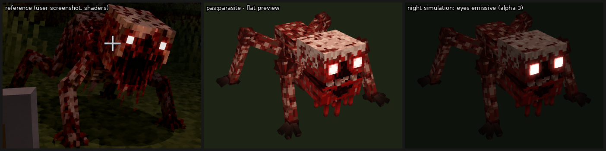
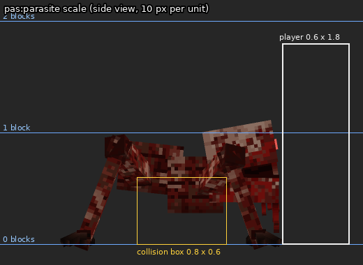
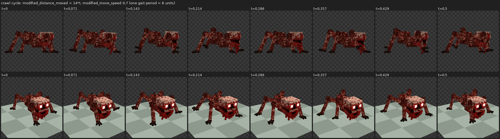
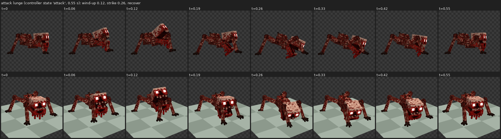
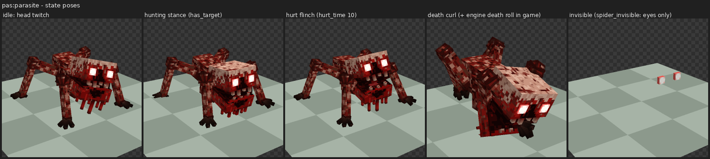
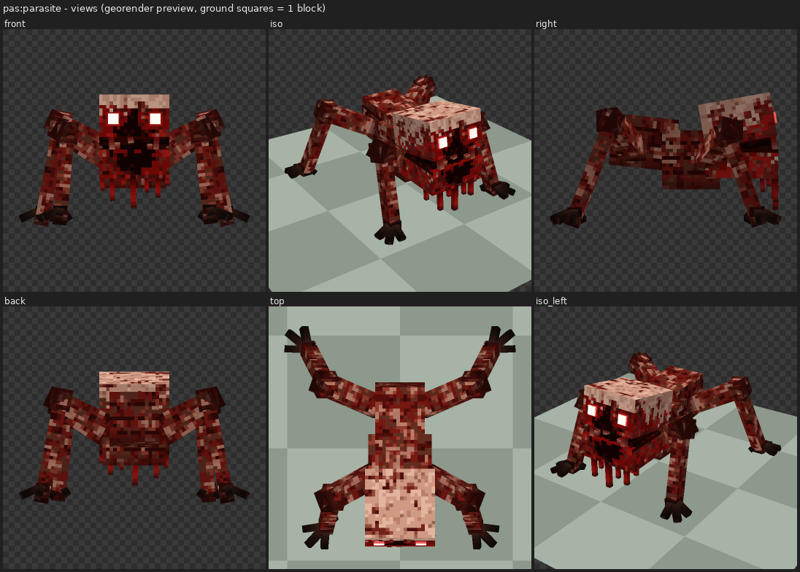

# pas:parasite — client visuals

The look of the outbreak crawler: geometry, texture, animations, animation
controllers, render controller and client entity. Everything here is generated
by `tools/art/parasite/`, and the art is original. No Mojang texture or model
file is copied. Vanilla assets are only referenced by name: the `spider`
materials and the vanilla Molang queries.

| file | content |
|---|---|
| `addon/resource_pack/entity/pas_parasite.entity.json` | client entity `pas:parasite` (format 1.10.0) |
| `addon/resource_pack/models/entity/pas_parasite.geo.json` | `geometry.pas.parasite` (format 1.12.0, 19 bones, 53 cubes, 64×64 texture units) |
| `addon/resource_pack/textures/entity/pas/parasite.png` | 128×128 RGBA, 2 px per texture unit, original pixel art |
| `addon/resource_pack/animations/pas_parasite.animation.json` | 7 animations (format 1.8.0) |
| `addon/resource_pack/animation_controllers/pas_parasite.animation_controllers.json` | 3 controllers (format 1.10.0) |
| `addon/resource_pack/render_controllers/pas_parasite.render_controllers.json` | `controller.render.pas_parasite` (format 1.8.0) |
| `tools/art/parasite/model.py` | joints, bones, cubes and the UV packer |
| `tools/art/parasite/anims.py` | animation and controller data, plus the client-entity scripts |
| `tools/art/parasite/make_parasite.py` | writes all six RP files above (deterministic, seed 7) |
| `tools/art/parasite/check_parasite.py` | consistency checks (see [Verification](#verification)) |
| `tools/art/parasite/render_previews.py` | writes the preview images in `docs/images/parasite_*.png` |

```bash
python3 tools/art/parasite/make_parasite.py      # regenerate the RP files
python3 tools/art/parasite/check_parasite.py     # bones / names / Molang / format versions / emissive mask
python3 tools/art/parasite/render_previews.py    # docs/images/parasite_*.png (+ scratchpad scale check and GIFs)
python3 tools/validate.py                        # whole-pack cross-check
```

Every format version is one that vanilla files of 1.21.0.26 use:

* geometry `1.12.0` (32 vanilla models);
* client entity `1.10.0` (87 vanilla entities, e.g. `zoglin.entity.json`, which also uses `scripts.animate`);
* animations `1.8.0`;
* controllers `1.10.0`;
* render controller `1.8.0`.

## Design (from the reference image)



The reference is a small, low crawler about 1 block tall. Its features:

* a big, blocky, pale head held forward and tilted up;
* two square white glowing eyes set wide in the upper face;
* a black gaping maw with ragged red edges that runs from between the eyes down through the jaw, with strands dripping below the head;
* a smaller mottled crimson/brown body hunched behind the head;
* four long, angular limbs with high elbows and knees, thin segments and dark splayed talons.

The model keeps that silhouette:

| part | size (units, 16 = 1 block) | notes |
|---|---|---|
| head (skull 10×6×10 + jaw 10×4×10) | 10×10×10 cube, y 6–16 | rest rotation x −10 (tilted up), front at z −14 |
| eyes | 1.5×1.5, protruding 0.3 | at x ±2.25..3.75, y 11.75–13.25 |
| body | chest 9×8×8, abdomen 7×7×9 (tilted) | behind and below the head; hump about y 14 |
| front legs | shoulder (±4, 8.5, −4) → elbow (±9.5, 12, −7) → foot (±10.5, 0.6, −11) | upper 3×3, lower 2×2 |
| back legs | hip (±3.5, 10, 6) → knee (±10.5, 13.5, 9) → foot (±13, 0.6, 14) | upper 3×3, lower 2×2 |
| overall | about 17.5 units tall at the tilted head's front edge, about 33 wide including the talons | BP collision box 0.8 × 0.6 |



The head top sits at about one block, half the height of the player's hit
box. A scale check next to the vanilla zombie and player models was rendered
in the scratchpad only, because it contains Mojang textures. It confirms the
head reaches about the zombie's waist.

### Palette

The colours were sampled from the reference with k-means clusters per region:
head top, head side, face, eyes, mouth, drips, body, legs and claws. The night
lighting (about 0.55) was divided out and the result hand-balanced. No pixel
of the reference is copied. All texels are painted procedurally by
`make_parasite.py`, which uses value noise, random-walk "splats" and
gradients.

| group | colours (RGB) | used for |
|---|---|---|
| pale skin | 228,182,160 · 208,154,132 · 186,128,108 · 156,100,84 | head cap and upper face |
| blotches / blood | 150,74,60 · 116,34,26 · 76,16,12 · 132,10,8 · 176,24,18 | splats on the head, red face, blood soak |
| flesh | 178,118,100 (pale flecks) · 146,60,46 · 118,24,18 · 82,14,10 · 96,46,32 (brown) · 50,9,6 | body and limbs |
| joints | 44,12,9 | darker ends of every limb segment, elbow knobs |
| maw | 20,3,3 · 46,6,5 · 96,10,8 · 148,28,22 | mouth hole, palate, tongue, gums |
| teeth | 112,24,18 → 146,66,52 → 176,118,98 | ragged, blood-stained teeth |
| eyes (emissive) | 255,252,246 front · 232,92,84 rim | alpha 3 |
| talons | 66,36,28 → 40,22,17 → 18,10,8 | near-black claws |

Texture layout (`docs/images/parasite_uv.png`): box UV for the skull, jaw,
chest, abdomen, leg segments, elbow knobs and foot knuckles. The left legs use
`mirror` and share the right legs' strips. Small parts use per-face UV onto
small swatches: throat, teeth, drips, talons and the two eye swatches. Every
box-UV cube has whole-unit sizes. Leg lengths are rounded up, so the strip
layout does not depend on how fractional box-UV sizes are handled.

## Bones

| bone | parent | pivot | purpose |
|---|---|---|---|
| `root` | – | 0,0,0 | parent of the body and all legs |
| `body` | root | 0,8,2 | chest + hunched abdomen; breathing, walk bob, lunge |
| `head` | body | 0,10,−4 (neck) | skull; rest x −10; look_at_target, twitches |
| `eyes` | head | 0,12.5,−14 | two emissive cubes |
| `mouth` | head | 0,10,−9 | dark throat box (visible when the jaw drops) + 5 upper teeth |
| `jaw` | head | 0,10,−4.5 (hinge at the back) | lower jaw + 2 teeth; x+ opens it |
| `drips` | jaw | 0,6,−13.5 | 7 hanging strands; sway |
| `leg_{fr,fl,br,bl}_upper` | root | shoulder / hip | upper segment; y = sweep, z = lift |
| `leg_*_lower` | `_upper` | elbow / knee | lower segment + knobbly joint; z = fold |
| `leg_*_claw` | `_lower` | foot | knuckle, three talons and a rear spur on the ground |

The legs are children of `root`, not `body`, so feet stay planted while the
body bobs. Leg segments are hanging cubes with a cube `rotation` about the
joint (`model.segment_rotation`, checked numerically against georender's
rotation matrix), so bone rest rotations stay 0. Animation rotations then act
in plain model axes about each joint:

* `y` sweeps a leg forward or back. Right legs: + means tip backward. Left legs: + means tip forward.
* `z` lifts a leg. Right legs: + means tip up. Left legs: − means tip up.

These are the sign conventions in `tools/georender/README.md`. Vanilla uses
multi-axis cube rotations with a cube pivot in 1.12.0 too: armadillo ears,
breeze rods, bogged mushrooms.

## Glowing eyes (emissive): approach and evidence

The whole model renders with the vanilla `spider` material, and `spider_invisible` when the entity is invisible. Eye texels have alpha 3; every other texel has alpha 255. This is exactly what vanilla does:

* `textures/entity/spider/spider.tga` and `cave_spider.tga` of 1.21.0.26 are RGBA. They have 20 texels with alpha 3 (the eyes) and 2028 with alpha 255.
* `spider.entity.json` and `cave_spider.entity.json` use `"materials": {"default": "spider", "invisible": "spider_invisible"}`.
* `controller.render.spider` uses `"materials": [{"*": "Array.materials[query.is_invisible]"}]`. Our `controller.render.pas_parasite` is the same controller with our own name.
* `enderman.tga` uses the same alpha-3 eye trick, with its own `enderman` material.

`tools/validate.py` limits our materials to names that vanilla client
entities and attachables use, and `spider` and `spider_invisible` are on that
list. `check_parasite.py` checks three things about the texture:

* the alpha values are exactly {3, 255};
* the 20 alpha-3 texels are exactly the `eye_front` and `eye_side` swatches;
* those swatches are what the two eye cubes sample.

What this gives in game:

* The eyes are full-bright: they ignore the block light level, like spider eyes, so they read in the dark.
* Because the material has no alpha test, the rest of the model is opaque.
* When the parasite is invisible (potion), `spider_invisible` draws only the emissive texels, so just the two eyes float in the dark, like an invisible spider. See `docs/images/parasite_poses.png`.

The `entity.material` file that defines `spider` is not part of
bedrock-samples. "spider = emissive-alpha material" is therefore inferred from
the vanilla texture plus the in-game look of spiders. It is not read from the
material file. The other option was a second render-controller pass for the
eyes with an emissive material. It was not used because it would need its own
geometry or texture plus a material choice with the same uncertainty, and the
spider route is the one vanilla itself uses.

## Animations and controllers

| animation | driver | what it does |
|---|---|---|
| `animation.pas_parasite.idle` | always (move controller) | breathing heave of the body; a head **twitch** every ~3.7 s (`variable.pas_twitch = pow(max(0, sin(life_time·97)), 24)`) plus a constant shiver; jaw hangs open about 11° and **trembles** (about 5 Hz); drips sway; front claws fidget |
| `animation.pas_parasite.walk` | weight `variable.pas_walk = min(1, modified_move_speed·1.4)`, `anim_time_update: query.modified_distance_moved` (as vanilla spider) | angular alternating crawl, see below |
| `animation.pas_parasite.look_at_target` | always | head pitch `clamp(target_x_rotation, −35, 25)`, yaw `clamp(target_y_rotation, −50, 50)` |
| `animation.pas_parasite.hunt` | attack controller state `hunting` (`query.has_target`) | stalking stance: body lower and pitched forward, head up, jaw wider with a fast tremble, front legs spread |
| `animation.pas_parasite.attack` | attack controller state `attack` (`variable.attack_time > 0.0`) | 0.55 s lunge, see below |
| `animation.pas_parasite.hurt` | weight `variable.pas_hurt = clamp(hurt_time / 10, 0, 1)` | flinch: body and head jerk back, jaw opens, front legs lift |
| `animation.pas_parasite.death` | life controller state `dead` (`!query.is_alive`), `hold_on_last_frame` | legs curl under the body like a dead insect, head lolls, body sinks. The engine's default death roll is applied on top. |

**Crawl:** the legs move in diagonal pairs, fr+bl and then fl+br. The gait
period is 8 units of `modified_distance_moved`. That is roughly 0.7 s at chase
speed, an estimate assuming about 0.55 units per tick. For each leg:

* the sweep is `±24 · clamp(cos θ · 1.5, −1, 1)`. The clamp makes the leg hold at the end of each stroke and then snap through, which gives the jerky, insect-like look;
* the lift is `20 · clamp(−sin θ · 1.8, 0, 1)` and only happens while the leg swings forward;
* the knee folds by 16° during the lift, and the talons curl;
* the body bobs low (−0.6 at stride ends) and yaws and rolls a little;
* the head counter-nods, the jaw flaps and the drips swing.



**Attack (lunge):**

1. Wind-up at 0.12 s. The body rears back and up, the head tilts up 24°, the jaw gapes to 34–40°, and the front legs rise high with their elbows folded.
2. Strike at 0.26 s. The body shoots forward 3.5 units and pitches down, the head drives forward, and the jaw **snaps shut** (a bite). The front talons slam down and forward, and the back legs shove.
3. Recover by 0.55 s.

The trigger follows vanilla. Hoglin, zoglin, zombie and humanoid controllers all start their attack on the engine variable `variable.attack_time`, which the client raises during a melee swing. Our behavior pack uses `minecraft:behavior.melee_box_attack`, which swings like the zombie and spider.



**Controllers** (`scripts.animate`: `move_controller`, `attack_controller`, `life_controller`):

* `controller.animation.pas_parasite.move`: one state that plays `idle`, `walk` (weighted) and `look_at_target`.
* `controller.animation.pas_parasite.attack`: states `default`, `hunting` and `attack`.
  * `default` → `attack` on `variable.attack_time > 0.0`, or → `hunting` on `query.has_target`.
  * `hunting` → `attack` on `variable.attack_time > 0.0`, or → `default` on `!query.has_target`.
  * `attack` → `hunting` or `default` on `query.all_animations_finished`, depending on `query.has_target`.
  * Blend transitions are 0.3 s, and 0.1 s into or out of the attack.
* `controller.animation.pas_parasite.life`: `alive` plays the weighted `hurt` and switches to `dead` on `!query.is_alive`. `dead` plays `death`.



**Molang used.** Every name was checked by `check_parasite.py` against this
build's `documentation/Molang.html`:

* queries: `query.anim_time`, `life_time`, `modified_distance_moved`, `modified_move_speed`, `target_x_rotation`, `target_y_rotation`, `has_target`, `hurt_time`, `is_alive`, `all_animations_finished`, `is_invisible`;
* math functions: `math.sin`, `cos`, `abs`, `clamp`, `min`, `max`, `pow`;
* variables: our own `variable.pas_*`, set in `pre_animation`, plus the engine variable `variable.attack_time`, which vanilla client files read without setting.

`query.life_time` is used in `pre_animation` exactly as 47 vanilla
`pre_animation` scripts do, for example the guardian spike shake and the agent.

## Client entity decisions

* `materials` `spider` / `spider_invisible`, `textures.default` `textures/entity/pas/parasite`, `geometry.default` `geometry.pas.parasite`, `render_controllers` `["controller.render.pas_parasite"]`.
* `enable_attachables: false` is set explicitly. That is also the default, and vanilla only ever writes `true`.
* `spawn_egg` colours `#6e1610` / `#d6a08a` are declared. The BP has `is_spawnable: false`, so no egg item exists and the block is inert. It is kept so the egg has the right colours if spawnability is ever enabled.
* Sounds are wired by the audio workstream in `sounds.json`. Nothing is declared here.

## Views



The preview images are:

* `parasite_views.png`: front, 3/4, side, back, top, 3/4-left;
* `parasite_walk.png`: crawl cycle from the side, top and 3/4;
* `parasite_attack.png`: the lunge from the side, top and 3/4;
* `parasite_poses.png`: idle twitch, hunting stance, hurt flinch, death curl, invisible;
* `parasite_vs_reference.png`: reference crop, flat preview, night simulation;
* `parasite_uv.png`: UV layout;
* `parasite_scale.png`: scale ruler.

All of them contain only our own texture, apart from the reference crop of
the user's screenshot in the comparison image. The scratchpad holds the
renders that include vanilla textures, `parasite_scale.png` (with the zombie
and player), and GIFs of the walk and attack.

## Verification

* `python3 tools/validate.py` passes with 0 errors. It checks that the geometry, texture, animations, controllers and render controller resolve, that the `Material.`/`Texture.`/`Geometry.` references match the description, and that the materials are on the vanilla whitelist.
* `python3 tools/art/parasite/check_parasite.py` checks:
  * every animated bone exists;
  * every animation short name and controller state resolves;
  * every query and math name is documented;
  * every variable is set or is a vanilla engine variable;
  * the format versions are used by vanilla;
  * every box-UV size is a whole unit;
  * the UV rects do not overlap;
  * the emissive texels equal the eye faces.
* `tools/georender` renders the client entity as the game composes it: render controller, materials, `pre_animation`, controllers and animations. The previews above come from it.

## Honest limitations

* **The reference is a cinematic, shader-lit screenshot.** It has soft shadows, ambient occlusion, bloom around the eyes, a dark colour grade and a vignette. Minecraft Bedrock 1.21.0.26 on Android with RenderDragon on a Mali-G57 has no ray tracing, no Vibrant Visuals and no dynamic shadows. Entities get vanilla per-block light and a fixed directional shade.
  * In daylight the parasite will look brighter and flatter than in the reference.
  * At night, only the eyes stay full-bright, and there is no bloom halo.
  * The "night simulation" panel in the comparison is a crude stand-in (darkened preview, full-bright eye texels, artificial blur), not a capture from the game.
* **Nothing here was checked in game.** georender follows conventions verified against vanilla data, not screenshots of 1.21.0.26.
* **Risks that cannot be confirmed offline:**
  * `variable.attack_time` on a custom entity. It is an undocumented engine variable that vanilla reads, and community add-ons rely on it for custom melee mobs. If it never rises, the lunge never plays. The `hunting` stance (`query.has_target`) still shows aggression, and nothing breaks.
  * `query.has_target` relies on the target being synced to the client, as for vanilla mobs.
  * The `spider` material's emissive behaviour is inferred (see above).
  * The game's handling of multi-axis cube rotation order (X, then Y, then Z, about the cube pivot) is taken from georender's vanilla-verified conventions. If it differed, the leg segments would point in slightly different directions.
  * The 128×128 texture on a 64×64-unit geometry relies on the engine normalising UVs by `texture_width`/`texture_height`, as HD packs do.
