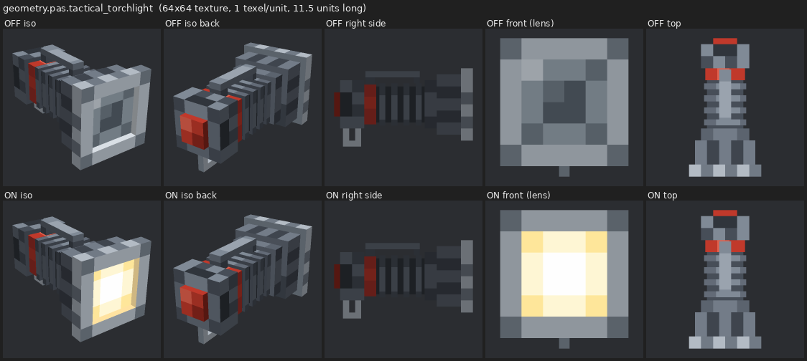
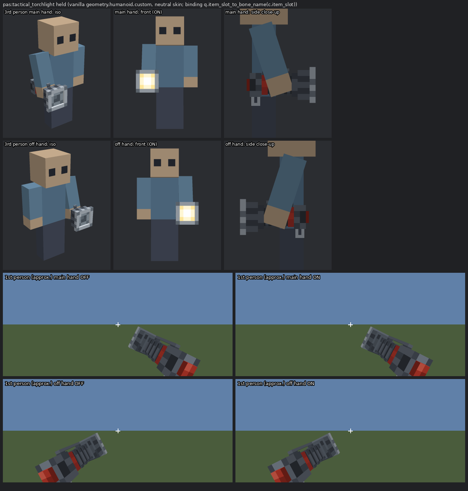

# Tactical torchlight: held 3D model

The model shown when a player (or mob) holds `pas:tactical_torchlight` or
`pas:tactical_torchlight_on`. It targets Bedrock **1.21.0.26**. Every binding and offset
below is derived from that build's `bedrock-samples` (`$REF`, see SPEC §0).

## Files

| file | what | made by |
|---|---|---|
| `addon/resource_pack/models/entity/pas_tactical_torchlight.geo.json` | `geometry.pas.tactical_torchlight`, 21 cubes, per-face UV | `tools/art/torchlight/torch_model.py` |
| `addon/resource_pack/textures/entity/pas/tactical_torchlight.png` | 64×64 texture, off state (grey lens) | `tools/art/torchlight/make_torch_texture.py` |
| `addon/resource_pack/textures/entity/pas/tactical_torchlight_on.png` | 64×64 texture, on state (warm-white lens, emissive alpha mask) | same |
| `addon/resource_pack/attachables/pas_tactical_torchlight.json` | attachable for the off item, material `entity_alphatest` | `tools/art/torchlight/hold.py` |
| `addon/resource_pack/attachables/pas_tactical_torchlight_on.json` | attachable for the on item, material `spider` (emissive) | same |
| `addon/resource_pack/animations/pas_torchlight.animation.json` | 2 anchor animations + first/third-person hold | same |
| `docs/images/torchlight_model.png`, `torchlight_hold.png`, `torchlight_calibration.png` | previews | `tools/art/torchlight/render_previews.py` |

To regenerate everything:

```bash
python3 tools/art/torchlight/torch_model.py && python3 tools/art/torchlight/make_torch_texture.py \
  && python3 tools/art/torchlight/hold.py && python3 tools/art/torchlight/render_previews.py
```

All four scripts are deterministic. No animation controller is needed, because
`scripts.animate` conditions are enough.

## Design



The design follows the 2D icon (`docs/images/icons_preview.png`): a gunmetal body with
grip ribbing, a red switch band, a silver bezel and a lens that is grey when off and warm
white when on. The texture is 1 texel per model unit, in Minecraft style. The model is 11.5
units long and is built along its length axis `L`, measured from the rear face of the tail
cap:

| part | cross-section | L | notes |
|---|---|---|---|
| clicky switch boot | 2 × 2 | −0.5 to 0 | red rubber; faces the camera in first person |
| tail cap | 4 × 4 | 0 to 2 | scalloped cut-outs at the rear, knurled ring at the front |
| switch band | 3.3 × 3.3 | 2 to 3 | red anodised (icon `s`/`S`) |
| grip | 3 × 3 | 3 to 7 | dark groove core with 4 raised rib rings (3.5 × 3.5, 0.5 long) |
| collar | 4 × 4 | 7 to 8 | flares into the head |
| head | 5 × 5 | 8 to 10 | longitudinal cooling flutes |
| bezel | 6 × 6 frame, 4 × 4 opening | 10 to 11 | four bars; silver knurl outside, shaded strike notches in front, polished reflector walls inside |
| lens | 4 × 4 | 10 to 10.5 | recessed 0.5 behind the bezel face |
| pocket clip | 1 wide | 2.1 to 6.6 | mount on the band, bar 0.5 above the ribs, bent tip |
| lanyard ring | 0.5 thick | 0.25 to 1.75 | U-loop under the tail cap |

The geometry axes are `X = x`, `Y = 24 + y` and `Z = 5 − L`. The lens points to geo −Z
(front). The grip centre (L = 5) is at the bone pivot `(0, 24, 0)`, the point that lands on
the hand (see below).

### Texture

The palette is the icon's `TORCH_BODY`/`TORCH_LENS_*` colours. The gunmetal tones are lifted
one step because the game shades side faces ×0.6–0.8 and bottoms ×0.5. Each face texel is
painted from its 3D position (L, across-the-face position), which gives the ribs,
knurling, flutes and so on. Cells are packed by a shelf packer with a 1-texel dilated
gutter, so edge sampling never hits a hole.

### Glowing lens (on state)

The on attachable uses the vanilla material **`spider`**, and its texture alpha is an
**emissive mask**: lens texels have alpha 3 (full-bright), the bezel reflector walls alpha
120 (half-lit), and everything else 255 (lit normally).

Evidence that `spider` works this way in this build:

* `$REF/entity/spider.entity.json` and `cave_spider.entity.json` use material `spider`.
* Their textures have an alpha histogram of {3: 20 px, 255: 2028 px}: exactly the eye texels
  are alpha 3, and spider eyes glow in the dark in-game.
* `enderman` (eyes α=3), `phantom` (eyes α=18) and `glow_squid` (whole body α=90) follow the
  same pattern.
* No texel is alpha 0, so the material is opaque and has no alpha test.

`spider` is also on `tools/validate.py`'s whitelist of materials used by vanilla client
entities. The bare name `entity_emissive_alpha` is not used by any vanilla entity in the
samples, so it was not used here.

The real light comes from light blocks (SPEC §5). There is no fake beam geometry.

## How attachables bind in 1.21.0.26: evidence

### 1. Binding rule

The geometry schema text in `$REF/documentation/Schemas.html` says:

> `binding`: "A molang expression specifying the bone name of the parent skeletal hierarchy
> that this bone should use as the **root transform**. Without this field it will look for a
> bone in the parent entity with the same name as this bone…"

Every vanilla held-item geometry uses `"binding": "q.item_slot_to_bone_name(c.item_slot)"`
on its root bone: `trident.geo.json`, `shield.geo.json` and `crossbow.geo.json`.
`spyglass.geo.json` switches the slot to `'head'` while scoping. `Molang.html` says
`query.item_slot_to_bone_name` "returns the name of the bone this entity has mapped to that
slot". For the player that is `rightItem` (pivot −6, 15, 1) or `leftItem` (6, 15, 1) in
`geometry.humanoid.custom`.

The position of the bound bone needs one more fact. Bedrock stores bone offsets relative to
the parent's pivot, and root bones are measured from `(0, 24, 0)` (see
`tools/georender/README.md`, "position starts at pivot − parent pivot, root bones from
(0,24,0)"). So the rule is:

```
world(p) = J · ( pivot − (0,24,0) + anim_position + R(anim_rotation) · S · (p − pivot) )
J = joint frame of rightItem/leftItem (origin at its pivot, rotating with the arm)
```

In words, the attachable's model point (0, 24, 0) sits on the hand bone's pivot. Checks
against vanilla data (`hold.py`, `render_previews.py --vanilla-textures`):

| vanilla item + animation | result with this rule |
|---|---|
| shield, `wield_third_person` (pos −0.4, 9, 9.3; rot −90, 0, 90; scale 1, −1, −1) | handle centre 0.8 units from the hand pivot. Plate centre at x = −8.9, just outside the arm's outer face (x = −8), facing outward. |
| spyglass scoping (bound to `head`, pos −1, 27, −3, rot 0, −90, 0) | tube from (−1..−3, 27..29, −3) forward to z = −14: in front of the right eye. |
| trident `wield_third_person` | prongs forward, shaft passing through the fist. |
| shield first person, main hand vs off hand | plate centres (+6.96, 13.09, 11.76) and (−7.30, 13.11, 11.81), both facing +Z: mirror images. The main hand goes through the rotated first-person arm and the off hand through the resting arm, so this symmetry would be hard to get by accident if the rule or the arm chain were wrong. |

Two alternatives were rejected:

* **Shared model space without the (0,24,0) re-basing.** This puts the shield at shoulder
  height inside the body and the trident through the chest.
* **Model origin on the hand pivot.** This puts the trident prongs 21.5 units above the hand.

`docs/images/torchlight_calibration.png` shows the vanilla shield, trident and spyglass
geometry placed by this rule, in flat debug colours.

### 2. Main hand vs off hand

The two hands are told apart with `c.item_slot`:

* `animation.shield.wield_third_person` uses `c.item_slot == 'main_hand' ? … : …`.
* `controller.animation.shield.wield` uses `c.item_slot == 'main_hand'` and `!= 'main_hand'`.

The binding expression itself picks `rightItem` or `leftItem` from `c.item_slot`.

### 3. First vs third person

* Vanilla attachables use the context variable `c.is_first_person`:
  * `animation.bow.wield` and `animation.crossbow.wield` (`c.is_first_person ? a : b`);
  * the trident and shield controllers (`"third_person": "!c.is_first_person"`);
  * the bow's `scripts.animate` condition (`"query.main_hand_item_use_duration > 0.0f && c.is_first_person"`).
* `query.is_first_person` also exists in `Molang.html`, but no vanilla attachable uses it.
  The player client entity uses `variable.is_first_person`.

We use `c.is_first_person` in `scripts.animate`, like the bow.

### 4. What the player draws in first person

`controller.render.player.first_person` hides every bone except `rightArm`/`rightSleeve`.
Those are shown only when the main hand is empty or holds a filled map. The left arm is
hidden too, except for maps and crossbow charging. So while the torch is held, the
attachable floats with no arm, like every vanilla held item in Bedrock.

The hidden arm still carries the item. `animation.player.first_person.empty_hand`, applied
whenever no map is held, sets:

* `rightarm` pos (13.5, −10, 12), rot (95, −45, 115);
* `rightitem`/`leftitem` pos `[0, pivot(arm).y − pivot(item).y − 7, −pivot(item).z]` =
  (0, 0, −1).

The swing, walk-bob, item-swap and breathing animations add to these, so the torch follows
the vanilla hand motion.

### 5. First-person camera model (approximate)

`animation.player.first_person.base_pose` rotates `body` by the view angles, so the body
frame is the camera frame. Four pieces of data only make sense if **model +Z is the view
direction** (+X is screen right):

* the empty-hand arm pivot moves to (8.5, 12, 12);
* the map-holding arms are placed at z +11.5 (`first_person.map_hold_main_hand` /
  `map_hold_off_hand`), and the crossbow-charging left arm at z ≈ +7.25 to +8.25;
* the off-hand shield ends up at z ≈ +12;
* the head gets `target_y_rotation + 180`.

With −Z as the view direction, all of these would be behind the camera. The eye is assumed
at `(0, 1.62·16/0.9375, 0) = (0, 27.65, 0)`: the standard eye height, with the player
`scale` 0.9375 undone. A 70° vertical FOV is used for previews. With this model, vanilla
items land where they appear in the game: shield backs in the lower corners and the trident
upright on the right (see the calibration sheet).

**This camera model is an inference, not an observation.** That is the main residual risk.

## The transform chain we ship

`geometry.pas.tactical_torchlight` has two bones, both with pivot (0, 24, 0):

1. **`torch_anchor`** is the root, with `binding: q.item_slot_to_bone_name(c.item_slot)` and
   no cubes. Its animations are fixed constants derived above:
   * `first_person_anchor_main_hand` pos (−14.973, 9.241, −14.175), rot (82.636, 61.26, −51.574);
   * `first_person_anchor_off_hand` pos (−6, 12.648, 0), rot (0, 180, 0).

   In first person they turn the hand frame into a **view frame at the eye**: the axes of an
   entity facing where the player looks (−Z forward, −X screen right, +Y up). In third person
   the anchor is not animated, so it stays the hand frame.
2. **`torch`** has `parent: torch_anchor` and holds all cubes. `hold_first_person` /
   `hold_third_person` read the variables below. For the off hand they mirror x position,
   y rotation and z rotation with `(c.item_slot == 'main_hand' ? 1.0 : -1.0)`.

`scripts.animate`:

```json
{"first_person_anchor_main_hand": "c.is_first_person && c.item_slot == 'main_hand'"},
{"first_person_anchor_off_hand":  "c.is_first_person && c.item_slot != 'main_hand'"},
{"hold_first_person": "c.is_first_person"},
{"hold_third_person": "!c.is_first_person"}
```

The render controller is vanilla `controller.render.item_default`, as used by the trident
and shield. It references `material.enchanted` and `texture.enchanted`, so both are defined.
The items have no glint, so `variable.is_enchanted` stays 0.

### Resulting poses

* **Third person.** The grip centre is 1.5 below the item pivot and centred in the fist. The
  lens points forward. x +18° cancels `animation.player.holding` (arm x −18° while holding),
  so the light is level when standing.
* **First person.** The grip centre is 10 units right of, 6.65 below and 18.5 in front of the
  eye, at scale 1.25. The lens aims at the crosshair 4 blocks ahead, and the top rolls 25°
  outward. On screen, the tail is at about (44° right, 33° down) and the lens at (19° right,
  13° down). The whole model spans 8–48° right and 1.5–42° down; the lowest tail-cap corner
  is cut by the bottom edge at a 70° vertical FOV. Every vertex is at least 11.5 units in
  front of the eye (16 units away), so nothing clips the near plane. The lens faces away from
  the camera, and the red tail switch faces it.



## Tweaking in-game (the variables)

Edit `scripts.initialize` in **both** attachable files and keep them identical. Units are
1/16 block. Values are for the **main hand**; the off hand is mirrored automatically.

| variable | value | meaning |
|---|---|---|
| `variable.pas_fp_pos_x` | −10.0 | first person: grip centre sideways from the eye. **Negative = right** (entity convention, −X = right) |
| `variable.pas_fp_pos_y` | −6.65 | first person: up (+) / down (−) from the eye |
| `variable.pas_fp_pos_z` | −18.5 | first person: **negative = forward** from the eye |
| `variable.pas_fp_rot_x` | −2.03 | first person pitch about the grip: + tips the lens down |
| `variable.pas_fp_rot_y` | −14.65 | first person yaw: + turns the lens to the right, − toward the screen centre |
| `variable.pas_fp_rot_z` | −25.62 | first person roll: + rolls the top toward the left |
| `variable.pas_fp_scale` | 1.25 | first person size |
| `variable.pas_tp_pos_x/y/z` | 0, −1.5, −1.0 | third person: grip offset from the hand pivot, in the hand frame (−z = forward, −y = down) |
| `variable.pas_tp_rot_x/y/z` | 18, 0, 0 | third person rotation (x + tips the lens down) |

Rules of thumb for first person:

* Torch too low on screen: raise `pas_fp_pos_y` (e.g. −6.65 → −4).
* Too far right: raise `pas_fp_pos_x` toward 0 (−10 → −8).
* Too close or too big: make `pas_fp_pos_z` more negative, or lower `pas_fp_scale`.

If the whole first-person frame turns out to be offset (a different camera height), only
these numbers change. The anchor constants encode vanilla data and should stay.

To retune through the generator, edit `FP_MAIN_CENTRE`, `FP_AIM_DISTANCE`, `FP_ROLL`,
`FP_SCALE`, `TP_POS` and `TP_ROT` in `tools/art/torchlight/hold.py` (body-frame, intuitive
inputs), then re-run it and `render_previews.py`.

## Verification done

* `render_previews.py` composes the vanilla `geometry.humanoid.custom` (from `$REF`, with a
  generated neutral mannequin skin) with our geometry re-parented by the binding rule. It
  plays the vanilla player animations (`holding`, `move.arms`, `first_person.empty_hand`,
  …) and our shipped animation and attachable JSON, evaluating the `scripts.animate`
  conditions with `c.is_first_person` and `c.item_slot`.
* It asserts that georender's own hierarchy evaluation matches `hold.py`'s solver at 32 probe
  points (on/off × main/off hand × first/third person). Only JSON rounding differs.
* The same pipeline puts the vanilla shield, trident and spyglass where they appear in game
  (`torchlight_calibration.png`). The vanilla-texture version of that sheet is written only
  to a scratch directory (`--vanilla-textures DIR`, refused inside the repo).
* `python3 tools/validate.py`: 0 errors. It checks that the attachables resolve their
  geometry, textures, animations and render controller, and that their materials are on the
  vanilla whitelist.

## Limitations and risks (honest list)

* **First-person placement can only be confirmed in-game.** The binding rule is well
  supported by vanilla data. The camera model (eye at 27.65 model units, model +Z forward,
  FOV) is inferred. If the torch sits too high, too low or too close on the phone, tune the
  `pas_fp_*` variables above.
* `spider` as an emissive-alpha material is inferred from vanilla textures; the vanilla
  `entity.material` is not in bedrock-samples. If the lens does not glow, the fallback is to
  try material `enderman` or `phantom` (same alpha-mask pattern) in the on attachable.
* Third-person off hand assumes the engine sets `variable.is_holding_left` for an off-hand
  item, so the left arm takes the −18° holding pose. If it does not, the torch tilts 18° down
  in the left hand. Cosmetic only.
* In first person the lens faces away from the camera, so on/off is not visible on the model
  itself. The world light and the actionbar message show the state.
* When the main hand draws a bow, vanilla pushes an off-hand shield out of the way
  (`off_hand_first_person_with_bow_pos_z`). The torch does not do this and may overlap the
  bow briefly.
* Mobs that pick the item up show it through the same third-person animation on their own
  item bones. Zombie-style forward arms point the torch upward, as vanilla swords do.
