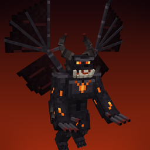
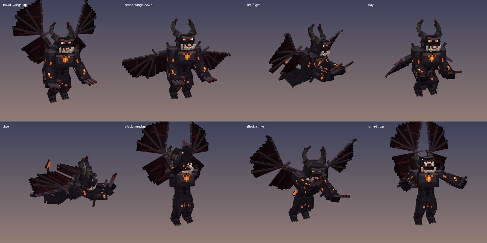

# Flying Guardian — Minecraft Bedrock add-on

A devil-like **Flying Guardian** you can tame with emeralds. Once tamed it flies beside you,
teleports back when you get too far away, and tears apart hostile mobs that threaten you.

Built for **Minecraft Bedrock beta/preview 1.21.0.26 on Android**, and checked against Mojang's
vanilla files from that exact build. No experimental toggles are needed.





## Download and install (Android)

1. Download [`dist/FlyingGuardian.mcaddon`](dist/FlyingGuardian.mcaddon) to your phone.
2. Tap the downloaded file and choose **Minecraft** to open it. Minecraft imports both packs and
   shows "Successfully imported".
3. Create a world, or edit an existing one. Under **Behavior Packs**, activate
   **Flying Guardian (Behavior)**. Minecraft adds **Flying Guardian (Resources)** automatically.
4. You don't need to turn on any experiments.

## Getting a Flying Guardian

- **Creative:** open the inventory and search for **Flying Guardian Spawn Egg**. It's with the
  other spawn eggs.
- **Command:** `/summon fguard:flying_guardian`
- **Survival:** a few spawn naturally, rarely, in mountain peaks, slopes and windswept hills, and
  in the Nether. Wild ones are neutral and only fight back if you attack them.

## Taming and controls

| Action | How |
| --- | --- |
| Tame | Hold **emeralds** and tap **Tame**. Each emerald has a 1 in 3 chance. Smoke means it failed. Hearts, a ring of fire and a roar mean it worked. It won't accept emeralds while it's angry. |
| Stay / Follow | Tap your tamed guardian with an empty hand. **Sit** makes it stay (it hovers in a guard pose), **Stand** makes it follow you again. |
| Heal | Feed it rotten flesh, raw or cooked meat, or emeralds (emeralds heal 50 HP). |
| Lead | Leads work as usual. A guardian on a lead doesn't teleport or dive. |

## Tamed behavior

- **Follows its owner by flying** beside you and a little above, over mountains, caves, oceans and
  lava.
- **Teleports back to you** when it gets too far away. It uses the normal pet teleport, and also
  teleports beside you mid-air if you fly off with an elytra or race across the ocean.
- **Protects you.** It attacks:
  - any mob that hurts you (players excluded),
  - hostile mobs that are targeting or attacking someone nearby,
  - hostile mobs that you attack.
- **Leaves alone:** you, all players (friends can't accidentally make it turn on them) and passive
  animals. Neutral mobs like endermen, piglins, zombified piglins and daytime spiders are left
  alone until they get angry and come after you.
- **Never damages you.** You can't hurt it by accident either: your own attacks do no damage to
  your guardian.

## Combat

- **Claw strikes:** 20–26 damage per hit, with heavy knockback, ember sparks and an impact sound.
  It usually kills zombies, skeletons and creepers in one hit.
- **Infernal Dive (flying attack):** when it's fighting a mob 4.5–18 blocks away, it launches
  itself through the air trailing fire. It hits for 10 bonus damage and sends out a fiery
  shockwave that damages and knocks back hostile mobs only.
- **Stats:** 200 HP, takes 35% less damage from everything, 75% knockback resistance. It takes no
  fall damage and is immune to fire, lava and suffocation, and doesn't drown. It's very strong but
  not invincible: a warden, a wither or a big horde can still kill it.
- A wild guardian you provoke hits for 8–12.

## Look and effects

Blocky dark-charcoal demon about 2.8 blocks tall:

- big crescent horns, glowing red-orange eyes, fangs and tusks, and a glowing jaw,
- a burning core in its chest and ember cracks in its skin,
- clawed hands and feet, and a spade-tipped tail,
- bat wings spanning about 4.5 blocks, with dark crimson veined membranes.

Animations: wing flapping that speeds up and leans forward in fast flight, hovering with a body
bob when it's still, a stay/guard pose, a dive pose, a two-claw slash, and a taming roar. It's
surrounded by drifting embers and dark smoke, and drops embers from its wings in fast flight. It
has its own growls, wing beats, claw swipes and impacts, all built from vanilla sound files.

## Technical notes

- Identifier `fguard:flying_guardian`. Behavior pack: entity, spawn rules, loot table and a script.
  Resource pack: client entity, geometry, `.tga` texture, animations, controllers, render
  controller, 11 particles, sounds, spawn egg and language files.
- The script uses the stable `@minecraft/server` **1.10.0** module, which is available in
  1.21.0.26 and doesn't need Beta APIs. Taming, following, sitting, targeting and basic attacks
  all live in the entity JSON. The script adds the extra knockback, the Infernal Dive and the
  long-range catch-up teleport.
- Glowing parts use the vanilla `entity_emissive_alpha` material, the same technique Mojang uses
  for enderman and spider eyes.
- `tools/validate.py` parses every JSON file and cross-checks every identifier: bones, locators,
  animations, controllers, particles, sounds, lang keys, component groups, events and items. Given
  a checkout of [Mojang/bedrock-samples](https://github.com/Mojang/bedrock-samples) at tag
  `v1.21.0.26-preview`, it also checks every component, filter, family, item, Molang query, sound
  file and script API call against that build.

### Rebuilding from source

```
pip install pillow numpy
python3 tools/build_assets.py      # geometry + texture (+ preview renders)
python3 tools/build_animations.py  # animations + animation controllers
python3 tools/build_particles.py   # particle effects
python3 tools/build_icons.py       # spawn egg
python3 tools/render_poses.py      # pose previews + pack icons
python3 tools/validate.py [bedrock-samples-checkout] [bedrock.dev-1.21.0-entity-docs.html]
python3 tools/package.py           # -> dist/FlyingGuardian.mcaddon
```

## Troubleshooting

- **It looks like a plain white or black box:** the resource pack isn't active. Check that
  **Flying Guardian (Resources)** is enabled in the world's Resource Packs.
- **No dive attacks or catch-up teleports:** make sure the *behavior* pack is active in the
  world. The script needs nothing else, and no experiments.
- **It won't tame:** it may be angry because something attacked it. Wait until it calms down,
  then try more emeralds.
