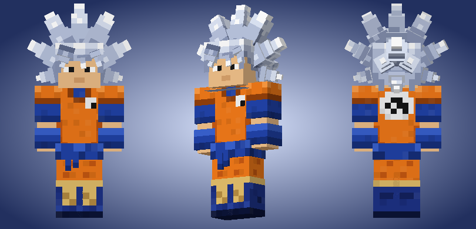
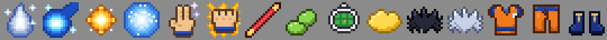

# Goku Ultra Instinct — Minecraft Bedrock Add-on

Become Goku in Minecraft: transform into **Ultra Instinct**, wear Goku's gi and
spiky hair, and fire the **Kamehameha**, **Spirit Bomb**, **Ki Blasts**, use
**Instant Transmission**, the **Dragon Fist**, the **Power Pole** and ride the
**Flying Nimbus**. Every power is an item in your inventory.

Made and tested for **Minecraft Bedrock 1.21.0.26 (beta) on Android** and works
on 1.21.0 and newer. **No experiments need to be turned on.**





## Install on your phone (Android)

1. Download **[`dist/GokuUltraInstinct.mcaddon`](dist/GokuUltraInstinct.mcaddon)**
   (on GitHub tap the file, then **Download raw file** / the download button).
2. Open your **Downloads** (or Files app) and tap `GokuUltraInstinct.mcaddon`.
   Choose **Minecraft** if your phone asks which app to use.
   Minecraft opens and shows *"Successfully imported Goku Ultra Instinct"* twice
   (once for each pack).
3. In Minecraft: **Play → Create New** (or the ✏️ edit button of a world).
4. Go to **Behavior Packs → Available**, tap **Goku Ultra Instinct (Behavior)**
   and press **Activate**. The resource pack is added by itself.
5. Turn **Cheats** on only if you want to use commands (not needed to play).
6. Create / play the world. You get a **Dragon Radar** when you join.

> If tapping the `.mcaddon` does nothing, use a file manager app, long-press
> the file → **Open with → Minecraft**. You can also import the two `.mcpack`
> files from the `dist` folder one by one.

## The items

| Item | What it does |
| --- | --- |
| **Ultra Instinct** | Use it to transform (use again to stop). Silver aura, Speed III, Strength III, Resistance, Jump Boost, Haste, night vision, slow healing, **no fall damage** and **automatic dodging**: you often dodge hits by yourself, flash behind the attacker and counter-punch. If you wear *Goku's Hair* it turns silver! |
| **Kamehameha** | "Ka… me… ha… me… **HA!**" Charge for a moment, then a giant blue energy wave fires where you look. Move your camera to sweep it. Blows up what it hits. |
| **Ki Blast** | Tap fast to throw yellow energy balls (alternating hands). |
| **Spirit Bomb** | Raise your hands and gather energy into a giant ball, then it flies to whatever you are looking at. **Huge explosion.** |
| **Instant Transmission** | Teleport to the spot you look at (up to 64 blocks). **Sneak + use:** appear behind the nearest enemy. |
| **Dragon Fist** | Dash forward and punch everything in your way, a golden dragon spirals out of your enemies. In Ultra Instinct it becomes the **Silver Dragon Flash**. |
| **Power Pole** | A strong staff. **Use** it to EXTEND and hit things far away. **Sneak + use** to pole-vault high up. |
| **Flying Nimbus** | Summons the golden cloud and puts you on it. It flies where you look. Use again (or sneak / dismount) to land. |
| **Senzu Bean** | Eat it: full health, full hunger, full ki, bad effects removed. |
| **Dragon Radar** | Opens the Goku menu: get every item, change settings, read how to play. |
| **Goku's Hair** (black), **Ultra Instinct Hair** (silver), **Goku's Gi**, **Gi Pants**, **Boots** | Goku's outfit. Wear them like armor (diamond-level protection). Wearing the gi, pants and boots together gives Speed and Jump Boost. |

### Ki (energy)

Attacks use **ki** — the bar at the bottom of the screen when you hold a power.
It refills by itself, faster in Ultra Instinct (which also makes attacks 40%
cheaper). **Sneak while holding a power** to power up and charge ki faster.
In Creative mode ki is unlimited.

| Move | Ki | Cooldown |
| --- | --- | --- |
| Ki Blast | 4 | 0.25 s |
| Power Pole extend | 4 | 1.5 s |
| Instant Transmission | 12 | 1.5 s |
| Dragon Fist | 25 | 4 s |
| Kamehameha | 30 | 5 s |
| Spirit Bomb | 70 | 12 s |

## Getting the items

* **Creative:** open the inventory, **Equipment** tab — all Goku items are at
  the end of the list.
* **Survival:** use the **Dragon Radar** you got when you joined →
  *Get Goku Items*. Lost the radar? Craft it: redstone on top, iron – glass –
  iron in the middle, iron at the bottom. Senzu Beans: wheat seeds + golden
  apple (makes 3).
* **Commands** (cheats on): `/scriptevent goku:kit` gives everything,
  or `/give @s goku:kamehameha` etc.

## Settings (Dragon Radar → Settings)

* **Big attacks break blocks** — on by default. Turn it off to protect your builds.
* **Infinite ki for everyone**
* **Show the ki bar**
* **Items cost XP levels in survival** — off by default (items are free).

## For builders / developers

```
goku-ultra-instinct-addon/
  GokuUltraInstinct_BP/   behavior pack: items, Nimbus entity, recipes, scripts/
  GokuUltraInstinct_RP/   resource pack: textures, models, attachables, particles, poses
  tools/                  Python generators for all pixel art, models and items
  build.py                packs dist/GokuUltraInstinct.mcaddon
```

* `python3 build.py --assets` regenerates every texture/model/item file and
  rebuilds the `.mcaddon` (needs Python 3 with Pillow and NumPy).
* Scripts use the stable `@minecraft/server` 1.10.0 and `@minecraft/server-ui`
  1.1.0 APIs, so no experimental toggles are required.
* Everything was tested on the Bedrock Dedicated Server **1.21.0.26 preview**
  (the same version as the game): the packs load without content-log errors,
  and every power was run with a test player.

Dragon Ball and its characters belong to Akira Toriyama / Bird Studio,
Shueisha and Toei Animation. This is a free fan-made add-on, not affiliated
with them or with Mojang.
