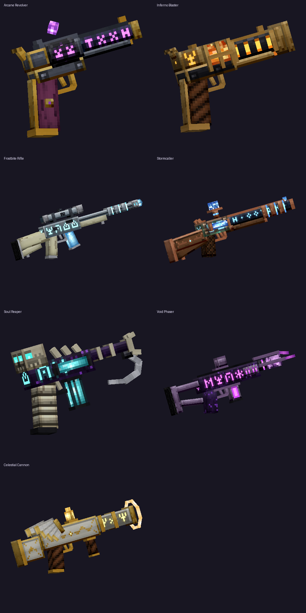
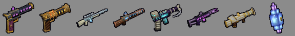
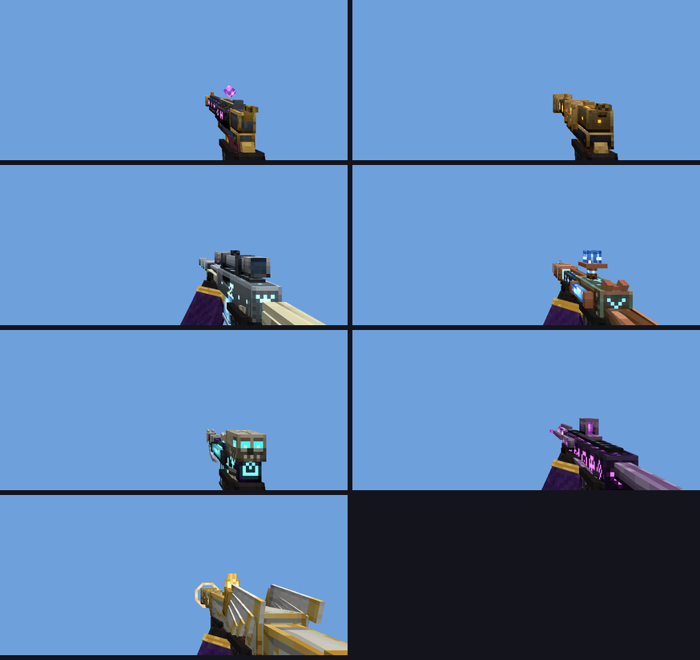
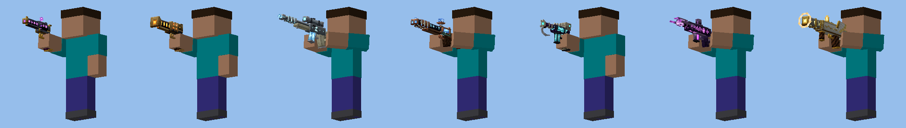

# ✦ Magic Guns — Minecraft Bedrock add-on

Seven magical and supernatural guns for **Minecraft Bedrock 1.21.0.26 (beta/preview) and newer**.
Every gun has a realistic, detailed 3D model held in your hand, an inventory icon, custom punchy
gunshot sounds (with random variations), glowing particles and its own magic power. It is built for **mobile**: tap to shoot, hold to keep firing.



| Inventory icons |
|---|
|  |

## Download & install (phone)

1. On your phone, open
   **[MagicGuns.mcaddon](https://github.com/lukmanhussen1990-cyber/my-first-website./raw/claude/minecraft-magical-weapons-mod-jm3uih/magic-guns-addon/dist/MagicGuns.mcaddon)**.
   The file downloads.
2. **Android:** open your *Downloads* / *Files* app, tap `MagicGuns.mcaddon` and choose **Minecraft**.
   **iPhone / iPad:** in the *Files* app, tap the file, press **Share** and pick **Minecraft**
   (or **Minecraft Preview** if that is the app you play the beta in).
   Minecraft opens and shows *"Successfully imported Magic Guns"* twice, once for each pack.
3. Create a world, or edit one, then go to **Behavior Packs** and activate **Magic Guns**.
   The resource pack, with models, sounds and particles, is switched on automatically.
4. Play. **No experimental toggles are needed.**

If tapping the `.mcaddon` doesn't open Minecraft, use the two separate packs in [`dist/`](dist/):
open `MagicGuns_BP.mcpack` and `MagicGuns_RP.mcpack` the same way.

## How to play

* **Get the guns:** Creative inventory → **Equipment** tab, or with cheats on:
  `/give @s magic_guns:arcane_revolver` (and the other names below).
* **Shoot:** tap the screen or the **Shoot** button while holding a gun.
  **Hold** to keep firing at the gun's own fire rate.
* The bar above your hotbar shows the gun's name, its durability and whether it is **READY**.
* Guns wear out in Survival. Repair them on an anvil with **Mana Crystals**.
* Guns enchant like **bows**: *Power* adds damage, *Punch* adds knockback, *Flame* sets targets
  on fire, *Infinity* halves wear, and *Unbreaking* and *Mending* work too.

| Gun | Power | Fire rate |
|---|---|---|
| **Arcane Revolver** `magic_guns:arcane_revolver` | Homing amethyst bolts that curve into enemies | fast |
| **Inferno Blaster** `magic_guns:inferno_blaster` | Fireballs that explode, sets mobs on fire (never breaks blocks) | medium |
| **Frostbite Rifle** `magic_guns:frostbite_rifle` | Long-range sniper. Pierces up to 3 mobs, freezes and slows them, turns water into (melting) ice | slow |
| **Stormcaller** `magic_guns:stormcaller` | 7-pellet shotgun that calls lightning and chains to 3 nearby enemies | slow |
| **Soul Reaper** `magic_guns:soul_reaper` | Rapid soul bolts. Wither curse plus life-steal that heals you | very fast |
| **Void Phaser** `magic_guns:void_phaser` | Shoot a block and you **teleport** there. Hit mobs blink away and float | slow |
| **Celestial Cannon** `magic_guns:celestial_cannon` | Holy blast: big area damage (double vs undead), heals nearby players | very slow |

## Crafting

First craft **Mana Crystals** (shapeless): amethyst shard + lapis lazuli + glowstone dust + redstone → 2 crystals.

| Gun | Recipe (crafting table, top row first) |
|---|---|
| Arcane Revolver | `iron iron mana` / `_ amethyst stick` / `_ _ stick` |
| Inferno Blaster | `gold gold fire_charge` / `_ mana blaze_rod` / `_ _ blaze_rod` |
| Frostbite Rifle | `packed_ice iron iron` / `stick mana diamond` / `stick _ _` |
| Stormcaller | `copper copper lightning_rod` / `_ mana iron` / `_ _ stick` |
| Soul Reaper | `obsidian obsidian soul_lantern` / `_ mana bone` / `_ _ bone` |
| Void Phaser | `end_rod ender_eye obsidian` / `_ mana obsidian` / `_ _ obsidian` |
| Celestial Cannon | `diamond gold glowstone` / `gold mana gold` / `gold _ _` |

All recipes appear in the recipe book once you pick up a Mana Crystal.

## Realistic holding

* **First person:** each gun points at the crosshair like in a shooter game. Bedrock hides your own arm
  while you hold an item, so every gun comes with a **gloved hand and magic-coat sleeve**.
  Rifles and the cannon are held with **both hands**.
* **Third person:** your character raises the gun and aims it where you look. Pistols are held
  one-handed, rifles two-handed. Armor stands and mobs also show the 3D models.




## Troubleshooting

* Turn on **Settings → Creator → Content Log GUI** to see any pack errors on screen.
* Gun shows as a flat icon in your hand: the resource pack isn't active. Check *Resource Packs* in the world settings.
* Guns do nothing when tapped: make sure the **behavior pack** is active in that world. Its scripts use the stable
  Script API (`@minecraft/server` 1.11.0), so the "Beta APIs" toggle is not required.

## For creators

Everything is generated by the Python tools in [`tools/`](tools/):

| File | What it does |
|---|---|
| `guns.py` | the 7 gun models as boxes, plus the first-person hands |
| `gunsmith.py` | procedural HD texture painting, Bedrock geometry export, software renderer for icons and previews |
| `sounds.py` | synthesises every sound effect (numpy → Ogg Vorbis via ffmpeg) |
| `particles.py` | particle sprite sheet and particle effect files |
| `tp_preview.py` | third-person preview renderer |
| `build.py` | builds both packs, the docs images and `dist/MagicGuns.mcaddon` |
| `validate.py` | ~3,500 static cross-checks of the built packs (references, UVs, alpha rules, sounds, particles, cooldowns) |

```sh
pip install numpy pillow    # plus ffmpeg on PATH
python3 tools/build.py
python3 tools/validate.py   # optional: pass a Mojang bedrock-samples checkout to also check vanilla ids
```

The gameplay scripts are hand-written in [`behavior_pack/scripts/`](behavior_pack/scripts/).
They type-check against the official `@minecraft/server@1.11.0` typings.
