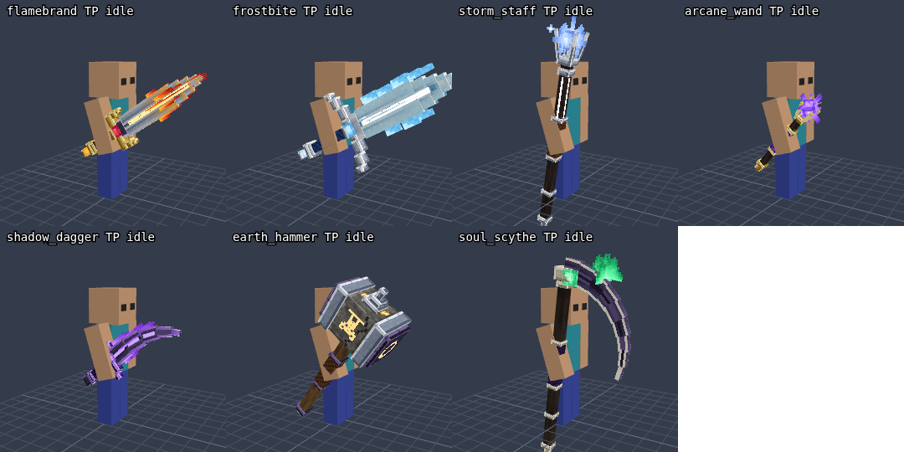

# ✦ Magical Weapons

Seven magical weapons for **Minecraft Bedrock Edition 1.21.0.26 (beta/preview) on Android**. Each one has its own
3D model, a spell you cast with a tap, a melee passive, and hand-built first- and third-person animations: an idle
hold with breathing sway, a swing that follows the game's real swing timing, and a dedicated cast animation that is
timed to the spell.



*Software-rendered preview of the pack's own models and animation data. The real game can look slightly different.*

> **Status:** everything was checked with validators, a mock of the scripting API and software previews, but
> the add-on has **not been run on a real device yet** (there is no Minecraft in the build environment). See
> [Known limitations](#known-limitations) and please report anything that looks or behaves wrong in game.

## Install on Android

1. Get **`MagicalWeapons.mcaddon`** (in this folder) onto your phone.
2. Open it: tap the file in your Files/Downloads app and choose **Minecraft**. The game shows *Import started* and
   then *successfully imported* for **Magical Weapons [Behavior]** and **Magical Weapons [Resources]**.
3. Create a world (or edit an existing one) → **Add-Ons** → **Behavior Packs** → **Magical Weapons [Behavior]** →
   **Activate**. The resource pack is attached automatically because the behavior pack depends on it; you can confirm
   under **Resource Packs**.
4. Enter the world and get a weapon from the creative inventory (**Equipment → Swords**), by crafting it
   ([recipes](#crafting)) or with a command, e.g. `/give @s mw:flamebrand`.

No *Experiments* toggles are needed: the add-on only uses the stable script module (`@minecraft/server` 1.11.0) and
the stable item format.

## How to play

| Action | What happens |
| --- | --- |
| **Hold** a weapon | Its hold pose and idle animation play. A hint appears above the hotbar, and the weapon sparkles. |
| **Tap to use** it (open air or a block) | Casts the weapon's spell. The cast animation plays and the weapon goes on cooldown. |
| **Tap a mob** | Normal melee hit with the weapon's attack damage, plus its passive effect. |

A notice appears on the action bar when the spell is ready again. Each cast costs durability (not in Creative).
Area spells can also hit other players and tamed pets; the caster, villagers, wandering traders, golems and
NPCs are never hurt.

## The weapons

Damage numbers are in HP (2 HP = 1 heart). Item ids all start with `mw:`.

| Weapon (`id`) | Spell | Melee passive | Cooldown | Attack | Durability |
| --- | --- | --- | --- | --- | --- |
| **Flamebrand** (`flamebrand`) | **Flame Wave**: a four-block crescent of fire races about 15 blocks along the ground, stepping up single blocks and fizzling on walls. 7 fire damage, sets enemies alight for 5 s, knocks them back. | Sets the target on fire for 6 s. | 6 s | 9 | 1800 |
| **Frostbite** (`frostbite`) | **Frost Nova**: plunge the blade and a ring of ice expands to about 7 blocks. 6 freezing damage, Slowness III for 6 s, knockback. You get Resistance I for 3 s and are extinguished. | Slowness II for 3.5 s. | 12 s | 10 | 1900 |
| **Stormcaller Staff** (`storm_staff`) | **Thunder Strike**: lightning hits where you aim (up to 34 blocks). 13 damage at the centre, 9 at the edge, sets enemies alight for 3 s, then chains to up to two more enemies within 6 blocks for 5 damage. A visual lightning effect: it never burns the terrain or converts villagers/creepers. | A small arc jumps to one nearby enemy for 2 damage. | 10 s | 5 | 1600 |
| **Arcane Wand** (`arcane_wand`) | **Arcane Missiles**: three homing bolts in a slight fan, each 5 magic damage, tracking enemies within 16 blocks and stopping at walls. | Sparkle only. | 2.5 s | 3 | 1400 |
| **Shadowfang** (`shadow_dagger`) | **Shadow Step**: blink up to 10 blocks forward (never through walls), slashing everything on the path for 6 damage and Slowness II. You get Speed II (2 s) and Slow Falling (2.5 s), and your next hit within 3.5 s deals +4 damage. | Backstab: +5 damage when the target is facing away from you. | 7 s | 7 | 1500 |
| **Earthshaker** (`earth_hammer`) | **Seismic Slam**: smash the ground in front of you and a shockwave rolls out about 7 blocks. 10 damage near the impact, 6 further out, and enemies are launched. | Heavy knockback on every hit. | 10 s | 12 | 2100 |
| **Soul Reaper** (`soul_scythe`) | **Soul Harvest**: drag up to 12 enemies within 9 blocks toward you for 5 damage and Slowness II. You heal 1 heart per enemy, up to 4 hearts per cast. | Sweeping reap: 4 damage to up to 3 other enemies near the target, heals you ½ heart. | 14 s | 9 | 1800 |

### Crafting

Shaped recipes for the crafting table (`·` is an empty slot). Anvil repair uses the item in the last column; each
unit restores 25 % of the weapon's durability.

| Weapon | Pattern | Ingredients | Repair with |
| --- | --- | --- | --- |
| Flamebrand | `·B·` / `MDM` / `·B·` | B Blaze Rod, M Magma Cream, D Diamond Sword | Blaze Rod |
| Frostbite | `·I·` / `PDP` / `·I·` | I Blue Ice, P Prismarine Crystals, D Diamond Sword | Blue Ice |
| Stormcaller Staff | `·E·` / `ALA` / `·L·` | E Eye of Ender, A Amethyst Shard, L Lightning Rod | Copper Ingot |
| Arcane Wand | `··A` / `·P·` / `B··` | A Amethyst Shard, P Ender Pearl, B Blaze Rod | Amethyst Shard |
| Shadowfang | `·P·` / `OSO` / `·P·` | P Ender Pearl, O Obsidian, S Iron Sword | Ender Pearl |
| Earthshaker | `III` / `IAI` / `·B·` | I Iron Ingot, A Diamond Axe, B Blaze Rod | Iron Ingot |
| Soul Reaper | `SSS` / `·H·` / `·B·` | S Soul Sand, H Diamond Hoe, B Blaze Rod | Soul Sand |

## Animations

* **Hold:** every weapon has its own grip in first and third person, with a subtle sway that reacts to how fast you
  move. Flames, runes, gems and crystals flicker or spin, and those parts are drawn unlit, so they glow in the dark.
* **Swing:** driven by the game's own swing progress, so it keeps pace with attack speed and restarts with every hit.
  In first person the weapon follows a wind-up → strike → follow-through path in camera space while compensating the
  vanilla arm motion; in third person the weapon moves relative to the swinging arm so the grip stays in the hand.
* **Cast:** tapping plays a raise → charge → release animation (0.7–1.4 s, depending on the weapon) whose strike frame
  lines up with the spell's effect. Flickering parts, such as Flamebrand's flames, swell while the spell is cast.

[First-person hold poses](docs/previews/idle_all_fp.png) · [Icons](docs/previews/icons.png) · Animation strips
(8 swing + 8 cast frames) and model turn-arounds per weapon:
[Flamebrand](docs/previews/flamebrand_tp.png) ([FP](docs/previews/flamebrand_fp.png), [model](docs/previews/flamebrand_model.png)) ·
[Frostbite](docs/previews/frostbite_tp.png) ([FP](docs/previews/frostbite_fp.png), [model](docs/previews/frostbite_model.png)) ·
[Stormcaller Staff](docs/previews/storm_staff_tp.png) ([FP](docs/previews/storm_staff_fp.png), [model](docs/previews/storm_staff_model.png)) ·
[Arcane Wand](docs/previews/arcane_wand_tp.png) ([FP](docs/previews/arcane_wand_fp.png), [model](docs/previews/arcane_wand_model.png)) ·
[Shadowfang](docs/previews/shadow_dagger_tp.png) ([FP](docs/previews/shadow_dagger_fp.png), [model](docs/previews/shadow_dagger_model.png)) ·
[Earthshaker](docs/previews/earth_hammer_tp.png) ([FP](docs/previews/earth_hammer_fp.png), [model](docs/previews/earth_hammer_model.png)) ·
[Soul Reaper](docs/previews/soul_scythe_tp.png) ([FP](docs/previews/soul_scythe_fp.png), [model](docs/previews/soul_scythe_model.png))

## Troubleshooting

* **The import fails or the file won't open:** make sure it still ends in `.mcaddon` (not `.zip`) and open it with
  Minecraft. The file should be about 167 KB.
* **Weapons show up but look like invisible/empty hands:** the resource pack isn't active. Add **Magical Weapons
  [Resources]** under the world's *Resource Packs*.
* **Tapping does nothing:** the behavior pack isn't active, or a script failed to start. Turn on
  *Settings → Creator → Content Log Settings → Enable Content Log GUI* and look for `[MagicalWeapons]` or scripting
  errors.
* **Messages about a missing or unsupported `@minecraft/server` version:** you are on a different build than
  1.21.0.26. Change `SERVER_MODULE_VERSION` in `tools/gen/emit.py` to a module version your build offers and rebuild
  (see below).
* **The old version keeps showing after an update:** remove the add-on from the world, restart Minecraft, import again.

## Known limitations

* **Not tested in the real game.** Poses, timings and the first-person camera framing were tuned in a software
  re-implementation of Bedrock's skeleton and Molang that was calibrated against vanilla items. Small differences on a
  device are possible; the pose numbers live in `tools/gen/weapons/*.py` and are easy to adjust.
* **Multiplayer:** the cast animation reads the item's cooldown timer, which Bedrock only tracks for the local player.
  Other players should see your swings and the spell effects but most likely not the cast pose.
* **Spell visuals are particles and sounds, not entities.** Nothing is spawned in the world, so there is nothing to
  clean up, but also no real projectiles or terrain damage.
* The swing animation reads the holder's `v.attack_time` through `c.owning_entity`. That is a community-documented
  technique and is not listed in Mojang's own documentation, so a future update could change it.
* Written for 1.21.0.x (`min_engine_version` 1.21.0, script module 1.11.0). Newer versions may need small manifest or
  API updates.

## Rebuilding and customising

Everything in `behavior_pack/` and `resource_pack/` is generated from the Python sources in `tools/` (standard library
only, Python 3.8+), except the hand-written scripts in `behavior_pack/scripts/`.

```sh
python3 tools/build_assets.py   # models, textures, animations, items, recipes, manifests
python3 tools/build_addon.py    # validate, then zip into MagicalWeapons.mcaddon
```

* Spell numbers, particles and sounds: `behavior_pack/scripts/abilities.js`
* Stats, recipes, hold poses and swing/cast choreography: `tools/gen/weapons/<weapon>.py`
* Pipeline, coordinate conventions and the optional preview and test tooling: [`tools/README.md`](tools/README.md)

```
MagicalWeapons.mcaddon          the importable add-on (both packs)
behavior_pack/                  items, recipes, scripts (the spells)
resource_pack/                  models, textures, attachables, animations, icons
docs/previews/                  software-rendered previews
tools/                          generators, validators, tests, preview renderer
```

All art, models and code were generated for this project; no Mojang assets are bundled (vanilla particles, sounds
and the enchantment glint are referenced by name).
