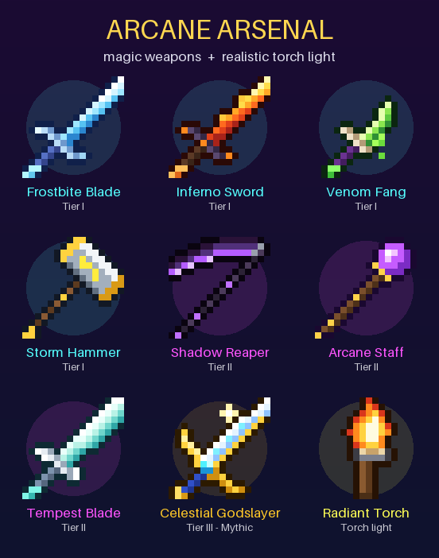

# Arcane Arsenal — Magic Weapons + Realistic Torch Light

A Minecraft **Bedrock** add-on (`.mcaddon`) made for **mobile**, built for your version
**1.21.0 (beta 1.21.0.26)**. It also works on newer versions.



- **8 magic weapons in 3 power tiers.** Each one has a spell, an on-hit power and some have a passive.
  The **Celestial Godslayer** is the strongest of all.
- **Torch light that feels real.** Hold a torch (or lantern, glowstone, lava bucket…) and the world
  lights up around you as you walk. Flames flicker, throw embers and smoke, and go out under water.
  Dropped torches keep glowing on the ground.
- **Radiant Torch.** A better torch: the brightest hand-held light, works in your **off-hand**,
  and has a **flashlight beam** that lights up far spots you look at.
- No experimental toggles needed. It uses only the stable Script API (`@minecraft/server` 1.10.0).

---

## Download & install (Android)

1. Download **[`dist/ArcaneArsenal_v1.0.0.mcaddon`](dist/ArcaneArsenal_v1.0.0.mcaddon)** on your phone.
2. Tap the downloaded file and pick **Minecraft**. Wait for "Import successful" (it imports 2 packs).
3. In Minecraft: **Play → Create New** (or edit a world) → **Behavior Packs** → activate
   **Arcane Arsenal (Behavior)**. Tap **Activate** when it asks to add the resource pack too.
4. Play! The weapons are in **Creative inventory → Equipment tab** (at the end), or craft them in survival.

> If tapping the `.mcaddon` doesn't open Minecraft, use the two fallback files in `dist/`
> (`ArcaneArsenal_BP_v1.0.0.mcpack` and `ArcaneArsenal_RP_v1.0.0.mcpack`) and open each one.

## How to use the weapons (touch controls)

- **Attack** normally: every weapon has an on-hit power.
- **Cast the spell**: **tap** (use) while holding the weapon, or press the on-screen button with the
  spell's name. Tapping a chest, door or crafting table just uses the block; it doesn't cast.
- Above the hotbar you'll see a **recharge timer**, then "**ready!**" with a soft ping. The hotbar
  icon also shows the cooldown.
- Open the inventory and select an item to read its **tooltip** (tier, spell, powers).

## The weapons

| Weapon | Tier | Damage | Spell (tap) | Cooldown | On hit | Passive (while held) |
|---|---|---|---|---|---|---|
| ❄️ **Frostbite Blade** | I · Enchanted | 8 | **Frost Nova**: freezing ring, hurts & slows all monsters within 7 blocks | 6 s | Slowness (20% chance: deep freeze) | **Frost Walker**: freezes water you walk next to |
| 🔥 **Inferno Sword** | I · Enchanted | 8 | **Flame Wave**: cone of fire in front of you | 5 s | Sets foes on fire | Fire Resistance, glows in your hand |
| 🐍 **Venom Fang** (dagger) | I · Enchanted | 6 | **Toxic Cloud**: lingering poison cloud (withers undead) | 8 s | Poison (Wither vs undead) + Weakness | Speed |
| ⚡ **Storm Hammer** | I · Enchanted | 10 | **Thunder Call**: lightning where you aim (up to 40 blocks) | 8 s | Heavy knockback, 30% **chain lightning** | — |
| 🌑 **Shadow Reaper** (scythe) | II · Legendary | 11 | **Shadow Dash**: blink 10 blocks forward, slashing foes on the way | 5 s | Wither II + **life steal** | **Soul Harvest**: kills heal you + Absorption |
| 🔮 **Arcane Staff** | II · Legendary | 5 | **Arcane Missile**: fast homing magic bolt | 1.25 s | Strong knockback | — |
| 🌪️ **Tempest Blade** | II · Legendary | 10 | **Cyclone**: hurls monsters away and lifts you up (slow falling) | 7 s | Updraft (launches foes up) | Speed + Jump Boost |
| ✨ **Celestial Godslayer** | **III · Mythic** | **25** | **Divine Judgement**: smites **every monster within 24 blocks** with holy light & lightning (40 damage each), heals and shields you | 10 s | Holy fire, Wither II, heals you, **chain smite** 2 more foes | Strength II, Resistance II, Fire Resistance, Speed, regeneration — **unbreakable** |

Spells are made safe for your world:

- Area spells only hit **monsters**. Villagers, iron golems, tamed pets, other players and farm animals are never hurt.
- Real lightning is used only far from you, and never near villagers or pets (so they don't turn into witches).
- Any fire it starts is put out, so your base won't burn.

## The Radiant Torch & torch light

- Hold a light source in your hand and your surroundings light up as you move. The light updates every tick, so it stays smooth.
  - **Torch** 14, soul torch 10, **lantern** 15, glowstone 15, sea lantern 15, froglights 15, jack o'lantern 15,
    **lava bucket** 15, campfire 15, end rod 14, glow berries 12, blaze rod 10, redstone torch 7 and more.
  - **Real flames flicker** a little (torches, lanterns, campfires, lava) and give off **embers**
    (blue for soul torches) and **smoke**. Glowstone, sea lanterns and froglights stay steady.
  - **Under water, flames go out.**
  - **Dropped** torches and lanterns keep glowing on the ground.
  - The Inferno Sword, Arcane Staff, Storm Hammer, Frostbite Blade and Godslayer glow too.
- **Radiant Torch**
  - Light level 15, the brightest hand-held light.
  - Put it in your **off-hand** so you can fight with a weapon and hold light at the same time.
  - Its **flashlight beam** lights up the spot you look at (7 to 40 blocks away). **Tap** with it to turn the beam on/off.
  - Hitting a mob with it sets the mob on fire.

## Crafting (survival)

Tier II weapons are forged from Tier I weapons, and the Godslayer fuses all three Tier II weapons:

```
Frostbite Blade        Inferno Sword          Venom Fang             Storm Hammer
 .  PI  .               .  BR  .               .  SE  .              CB  LR  CB
PI  DS  PI             MG  DS  MG             FE  IS  FE             CB  DI  CB
 .  PI  .               .  BR  .               .  SE  .               .  ST  .

Shadow Reaper          Arcane Staff           Tempest Blade          Celestial Godslayer
 .  EE  .               .  AB  .               .  FT  .               .  NS  .
CO  VF  CO             FB  DB  IN             PM  SH  PM             SR  BE  AS
 .  NI  .               .  BR  .               .  NI  .               .  TB  .

Radiant Torch
 .  GD  .
GD  TO  GD
 .  GI  .
```

`PI` packed ice · `DS` diamond sword · `BR` blaze rod · `MG` magma block · `SE` spider eye ·
`FE` fermented spider eye · `IS` iron sword · `CB` block of copper · `LR` lightning rod · `DI` diamond ·
`ST` stick · `EE` eye of ender · `CO` crying obsidian · `NI` netherite ingot · `AB` amethyst block ·
`DB` diamond block · `FT` feather · `PM` phantom membrane · `NS` nether star · `BE` beacon ·
`GD` glowstone dust · `TO` torch · `GI` gold ingot · `VF`/`FB`/`IN`/`SH`/`SR`/`AS`/`TB` = the Arcane weapons
(Venom Fang, Frostbite Blade, Inferno Sword, Storm Hammer, Shadow Reaper, Arcane Staff, Tempest Blade).

The recipes also show up in the in-game recipe book. Weapons can be enchanted (sword enchantments)
and repaired on an anvil (diamond / copper block / netherite ingot / amethyst shard).

## Commands (need cheats on)

| Command | What it does |
|---|---|
| `/function arcane/give_all` | Gives you every Arcane Arsenal item |
| `/function arcane/help` | Shows the quick guide in chat |
| `/function arcane/lights_off` / `lights_on` | Turn the dynamic torch light off/on (e.g. for a very old phone) |
| `/function arcane/flicker_off` / `flicker_on` | Steady light instead of flickering flames |
| `/function arcane/particles_off` / `particles_on` | Hide/show embers, smoke and weapon auras near your hand |
| `/function arcane/hud_off` / `hud_on` | Hide/show the spell recharge text |

## Troubleshooting

- **Items are purple/black or have odd names**: the resource pack isn't active. Add **Arcane Arsenal (Resources)** under Resource Packs.
- **Weapons exist but spells/torch light do nothing**: make sure the **behavior pack** is active on that world.
  Your game must be 1.20.80 or newer (1.21.0 beta is fine).
- **Want the normal darkness back**: `/function arcane/lights_off`. This removes every light block the add-on placed.

## For developers

```
python3 tools/build.py   # regenerate textures + pack files and build dist/*.mcaddon
npm test                 # run the add-on against a simulated @minecraft/server 1.10.0
npm install && npm run typecheck   # type-check scripts against the real 1.10.0 API typings
```

- `tools/sprites.py`: all pixel art as editable ASCII grids.
- `tools/make_packs.py`: items, recipes, particles and names come from one table, so they stay in sync.
- `packs/ArcaneArsenal_BP/scripts/`: `weapons.js` (spells), `lights.js` (torch light), `main.js` (events).
- `test/`: a strict fake of the Script API. It covers every spell, safety rule, the light system,
  reload cleanup and newer-version light ids, plus pack cross-checks.
