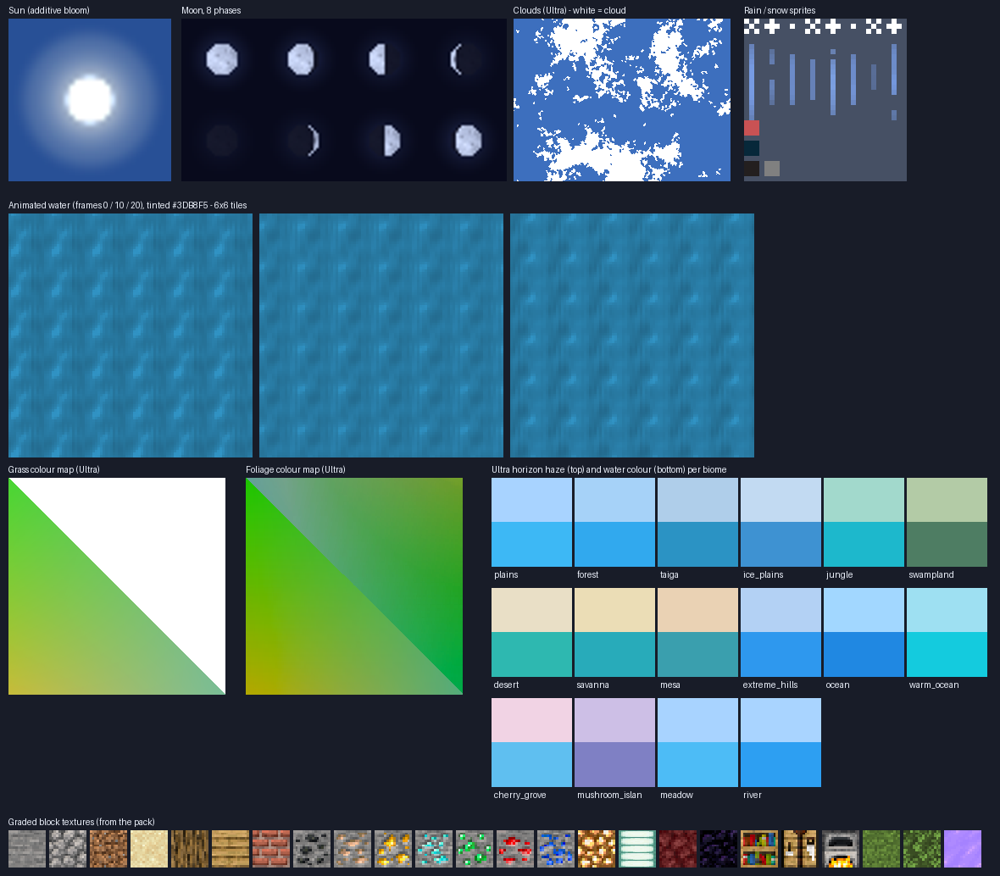

# Horizon Glow Graphics — mobile graphics add-on for Minecraft Bedrock 1.21.0.26

Built for: **Minecraft Bedrock (Android) beta/preview 1.21.0.26 · RenderDragon · OpenGL ES · realme RMX3612 / Mali-G57 MC2**
Format: `.mcaddon` (a resource pack — nothing to install besides the game itself, no root, no launcher mods)

## Download

| File | What it is |
| --- | --- |
| [`dist/HorizonGlow_Graphics_and_AmbientFX_1.21.0.mcaddon`](dist/HorizonGlow_Graphics_and_AmbientFX_1.21.0.mcaddon) | **Recommended – the full experience.** Graphics pack + optional Ambient FX pack (fireflies, dust, plankton). Tap it on your phone → *Open with Minecraft*. |
| [`dist/HorizonGlow_Graphics_1.21.0.mcaddon`](dist/HorizonGlow_Graphics_1.21.0.mcaddon) | Graphics pack only (the safest option – no player-entity override). |
| [`dist/HorizonGlow_Graphics_1.21.0.mcpack`](dist/HorizonGlow_Graphics_1.21.0.mcpack) | Same graphics pack as a plain `.mcpack` (if your browser/file manager refuses `.mcaddon`). |
| [`dist/HorizonGlow_AmbientFX_OPTIONAL_1.21.0.x.mcpack`](dist/HorizonGlow_AmbientFX_OPTIONAL_1.21.0.x.mcpack) | The Ambient FX pack on its own (see below). |

Direct link (works in the phone browser while you are logged in to GitHub):
`https://github.com/lukmanhussen1990-cyber/my-first-website./raw/claude/minecraft-mobile-graphics-mod-kov7rd/minecraft-graphics-mod/dist/HorizonGlow_Graphics_and_AmbientFX_1.21.0.mcaddon`

If Android saves a file as `.zip`, rename it to `.mcaddon` / `.mcpack` and tap it again.

## Install (30 seconds)

1. Open the downloaded `.mcaddon` → choose **Minecraft** (it says "Import started … success").
2. In Minecraft: **Settings → Global Resources → My Packs → Horizon Glow Graphics → Activate**
   (and, if you imported the full add-on, **Horizon Glow Ambient FX → Activate** as well).
   Global = applies to every world. You can also activate packs per world: *Edit world → Resource Packs*.
3. Tap the **gear / settings icon** on the active pack and move the slider to pick a preset
   (on a phone like yours the game should pick **Ultra** by default).
4. Recommended video settings: *Render distance 10–12, Fancy graphics ON, Beautiful skies ON, Smooth lighting ON, Fancy leaves ON, Render clouds ON.*

### How to tell it is working (30-second check)

Load any world in daylight and look at the horizon:
1. **Sun** – a bright round sun with a soft glow (vanilla is a hard yellow square).
2. **Clouds** – fluffy banks with clear gaps instead of fine speckle.
3. **Distance** – far hills fade into a coloured haze rather than cutting off abruptly.
4. **Water** – clearer, more saturated, you can see the sea floor; ripples with tiny sun glints.
5. **Ultra only** – the screen corners are slightly darker (vignette) while the HUD stays crisp.
At night: a round moon with 8 proper phases (and fireflies if you installed the Ambient FX pack).

## Presets (pack settings slider)

| Preset | Look | Cost |
| --- | --- | --- |
| **Lite** | Near-vanilla haze, slightly richer colours, clearer water | lowest |
| **Standard** | Balanced aerial-perspective fog, vivid grass/leaves/water, soft clouds | low |
| **Ultra** *(default)* | Strong atmospheric haze per biome, most vivid colour, fluffier clouds, cinematic vignette over the HUD | low |

All three keep the textures at 16×16, so FPS stays close to vanilla — the effects are fog, colour and lighting-style cues, not extra GPU work.

## What it changes


*The assets the pack ships (an asset sheet, not an in-game screenshot).*

* **Atmosphere** – 91 biome fog definitions: distant terrain fades into a coloured horizon haze (warm over desert/savanna, teal over jungle, pale blue on snow, murky green in swamps, pink over cherry groves), cave biomes left alone. Rain gets a brighter, bluer overcast. Nether fog is pushed out so it is readable on a phone; the End gets a faint violet haze.
* **Water** – every biome has its own clear, saturated water colour and lower opacity (see the sea floor); swamps stay murky. New animated water with soft ripples and sun glints (loops seamlessly), re-authored flowing water.
* **Sky** – round, glowing sun with bloom; smooth moon with maria, 8 correct phases; new cloud pattern (fluffy banks with gaps instead of speckle); brighter, more visible rain.
* **Colour** – grass, leaves, birch/spruce and swamp colour maps re-graded in a perceptual colour space ("vibrance": dull colours gain more than already vivid ones, so nothing goes neon). The grass-block side fringe uses the exact same grade so tops and sides match.
* **Textures** – ~2,300 textures (all blocks, items, mobs, worn armour, flame/particle sprites) get one consistent film grade (vibrance, gentle S-curve, warm highlights / cool shadows), baked relief lighting on opaque blocks (more depth), glints on ore flecks, brighter light sources (glowstone, lanterns, froglights, lava, …), stronger contrast in leaves. File names, sizes and formats are identical to vanilla, so nothing else is touched.
* **Ultra only** – a soft vignette image drawn *behind* the HUD for a filmic frame.

## Optional: Ambient FX pack

`HorizonGlow_AmbientFX_OPTIONAL_1.21.0.x.mcpack` adds **fireflies at night, drifting sunlit dust by day and plankton underwater** — pure vanilla particles, no scripting, a few dozen particles on screen at most.
It is a *separate* pack because, to emit particles around the camera, it has to replace Mojang's client file for the player (`entity/player.entity.json`, the only change is three added lines — see `tools/gen_ambient.py`). That file belongs to the game version it was copied from, so **use it on 1.21.0.x only** and remove it after a game update. Activate it *in addition to* Horizon Glow.

## Honest limits (please read)

* This is **not** a "RenderDragon shader". Real shader packs (dynamic shadows, screen-space reflections, volumetric light, waving water) replace the game's compiled `.material.bin` files. As far as I can determine, Minecraft 1.21.0.26 on Android does not load those from an ordinary resource pack (people use patched games or launchers for that), and the official shader system (deferred lighting / "Vibrant Visuals") only arrived in later game versions. Treat any download that promises shadows and reflections from a plain `.mcaddon` on the Play Store version with suspicion.
* So this pack uses **everything a normal add-on can legitimately change** — fog, water, sky bodies, clouds, weather, colour maps, textures, HUD — and tunes it together to get the closest shader-like feel without costing frame rate.
* Not included on purpose: dynamic torch light. It needs a behavior pack with scripts that place invisible light blocks in your world, which I would not ship without testing it in-game.
* The sky *dome* colour (the blue overhead) is computed by the game from biome temperature and cannot be changed by packs in this version; the pack colours the **horizon haze** instead.
* I could not run the game while building this (no device in the build environment), so everything was verified against Mojang's own 1.21.0.26 data files and documentation, with an automated validator (`tools/validate.py`) rather than on a phone. If anything looks wrong, tell me the preset and what you see.

## Troubleshooting

* **Nothing changed** → Settings → Global Resources → make sure *Horizon Glow Graphics* is in the **Active** list, and drag it to the top.
* **Pack imported but not listed** → older/unsupported version: the pack declares `min_engine_version 1.21.0`.
* **Colours look too strong** → pick *Standard* or *Lite* with the gear icon.
* **Other resource packs** → anything above Horizon Glow in the list wins; keep other texture packs *below* it if you want both.
* **No vignette** → it only exists in the *Ultra* preset.

## Legal

Fan-made, non-commercial, not affiliated with Mojang or Microsoft.
About 2,300 textures in the pack are **modified derivatives of Minecraft's own textures** (© Mojang AB — a colour grade and baked lighting, nothing redrawn), plus one modified copy of the player's client entity file in the optional Ambient FX pack. That makes this pack **personal-use only**: do not sell it, and read the Minecraft Usage Guidelines before sharing it publicly (keep this repository private if in doubt). Everything else — fog tables, sun, moon, clouds, water, vignette, particles and the generator scripts — was created from scratch for this project.

## Rebuilding / developers

```
git clone --depth 1 --branch v1.21.0.26-preview https://github.com/Mojang/bedrock-samples.git /tmp/bedrock-samples
python3 -I tools/build.py    --vanilla /tmp/bedrock-samples/resource_pack   # regenerates pack/ and dist/
python3 -I tools/validate.py --vanilla /tmp/bedrock-samples/resource_pack   # static checks
```

Python 3 + Pillow + numpy only. `WORKLOG.md` has the build timeline; `docs/asset_preview.png` is generated by `tools/make_preview.py` (an asset sheet, not an in-game screenshot).
