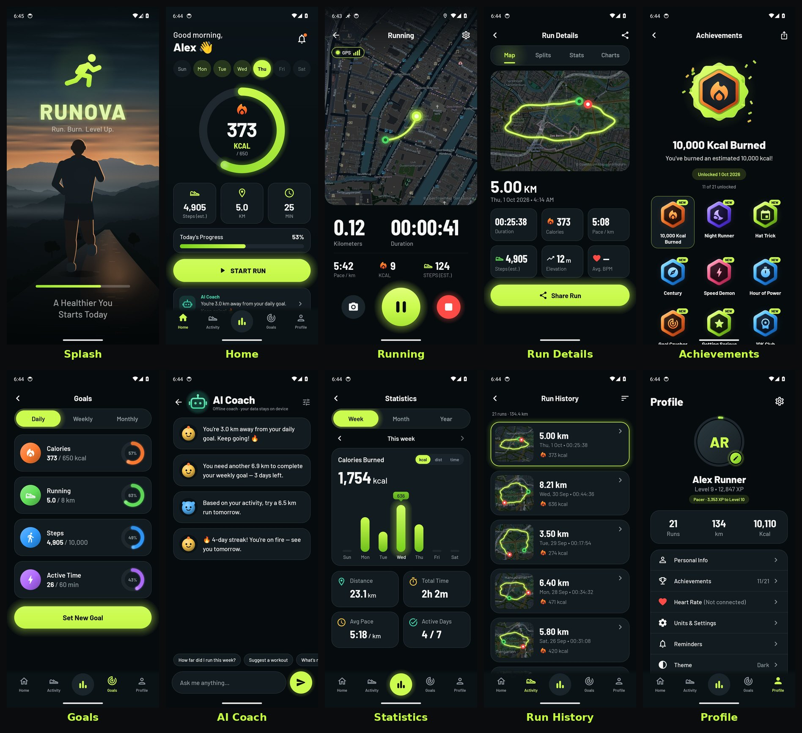

# RUNOVA — Run. Burn. Level Up.

RUNOVA is an Android running app with GPS tracking, a live route map, calorie and step estimates, goals, XP and levels, streaks, achievements and an AI coach that works offline and can optionally use Claude. It uses a dark theme with a neon-lime accent.



<sub>Splash · Home · Running · Run Details · Achievements · Goals · AI Coach · Statistics · Run History · Profile. These are screenshots of the real app on an Android 14 emulator, taken by the instrumented tests in CI after recording six weeks of runs through the app's own tracker. All captures are in [`docs/device`](docs/device), including onboarding, a mock-GPS run, crash recovery and the release build.</sub>

## Install

`dist/RUNOVA.apk` runs on Android 8.0 (API 26) and newer.
1. Copy the APK to your phone and open it.
2. Allow installing apps from that source when Android asks.
3. On first launch, a short onboarding asks for your name, units, body data and daily goals. It then asks for location, activity and notification permissions; each one can be skipped and granted later.

The APK is the R8-shrunk release build. It is signed with the project's bundled debug key because no release keystore is configured (see *Release signing* below). Sign it with your own key before you distribute it.

## Status

GitHub Actions (`.github/workflows/runova-android.yml`) builds and checks the app on every push. It uses the official Android SDK and an Android 14 emulator.

| Check | Result |
|---|---|
| Debug and release builds; the release build is shrunk with R8 | ✅ |
| Domain tests (`core/`): tracking, calories, steps, XP, levels, streaks, achievements, rewards, stats, GPX, offline coach | ✅ 43 pass |
| Claude client tests (`claude/`) against a local fake API | ✅ 9 pass |
| Screen-state mapping and heart-rate parsing (`app/src/shared/.../state`), run on the JVM by `tools/ui-preview` (locally, not in CI) | ✅ 14 pass |
| Robolectric app flows (`app/src/test`): run with pause/resume and save, discard, crash recovery, settings across restart, delete all | ✅ 5 pass |
| Android lint (release) | ✅ 0 errors |
| Instrumented flows on the emulator (`app/src/androidTest`): onboarding and every tab, denied location, a mock-GPS run with pause/resume/finish and a restart check, every screen with six weeks of runs, a run left recording for the crash check | ✅ 5 pass |
| Crash check: the app is killed mid-run, relaunched, and the recovered run is saved | ✅ |
| Release APK smoke test: onboarding, start and discard a run, live Claude API call with an invalid key that must be rejected | ✅ |

The release smoke test earned its place: it caught R8 stripping two constructors that Jackson reaches only through annotations, which broke every Claude request in the shrunk build. `app/proguard-rules.pro` now keeps them.

## Features

**Run tracking**
- GPS tracking in a foreground service (type `location`), so it keeps running with the screen off. A partial wake lock and 1 s GPS updates are used.
- Live route map on OpenStreetMap tiles with follow mode, pinch-zoom and start/current markers. The dark map is the standard OSM map recoloured on the device.
- Distance, timer, current pace (20 s window, smoothed) and average pace.
- Pause and resume. Resuming starts a new route segment, and time spent paused never counts.
- Optional auto-pause: the run pauses when you stop and resumes when you move.
- GPS filtering:
  - Rejects fixes with poor accuracy (> 30 m).
  - Speed-spike filter that re-anchors after persistent spikes.
  - Jitter gate that uses Doppler speed, so standing still adds no distance.
  - Smoothed elevation with hysteresis.
- Splits every km or mile, with a spoken announcement and an on-screen toast.
- 3-second countdown (optional) while GPS warms up.
- Heart rate from any Bluetooth LE strap or watch that exposes the standard Heart Rate service (0x180D). It reconnects automatically after drop-outs.
- Steps from the hardware step counter when available, otherwise estimated from distance, speed and height (marked as an estimate).
- Photos during a run (camera app via `TakePicture`).
- Ongoing notification with live distance, time and pace, plus Pause/Resume actions.
- Crash recovery:
  - The run is checkpointed to SQLite every 5 s and on every pause or resume.
  - If the process dies, the next launch offers to resume, save or discard it.

**After the run**
- An animated summary counts up distance, time, pace and calories.
- It then shows the XP lines, the level bar (with a level-up badge and confetti), unlocked achievements and completed goals.
- Run details has four tabs: Map, Splits, Stats and Charts (pace, elevation and heart rate).
- Share a rendered 1080×1350 run card, export GPX, or delete the run.

**Progress**
- Stats by week, month and year for calories, distance or time. You can page back through earlier periods, and each view shows total time, average pace and active days.
- Daily figures (calories, steps, distance, active minutes) appear on Home for any day of the week.
- Goals:
  - Daily, weekly and monthly targets for calories, distance, steps and active minutes, all editable.
  - Each goal pays XP once per period: 30 (daily), 100 (weekly) or 300 (monthly).
- XP:
  - 50 XP per km, 2 XP per active minute.
  - +25 for the first run of the day, +50 for 5 km+.
  - Streak bonus of 5 XP per streak day (max 50).
  - Achievement XP.
- Levels: level *L* needs 200·(L−1)² XP in total, with titles Rookie → Jogger → Runner → Pacer → Racer → Elite → Legend.
- Streaks: a day counts with a run of ≥ 0.5 km or ≥ 5 min. The current and longest streak are both tracked.
- 21 achievements:
  - First Steps, First 5K!, 10K Club, Half Marathon, Marathon Legend.
  - Hat Trick, 7-Day Streak, Unstoppable, Century, Road Warrior.
  - Getting Serious, Dedicated, 10,000 Kcal Burned, Night Runner, Early Bird.
  - Speed Demon, Hill Climber, Hour of Power, Goal Crusher, Weekend Warrior, Level 10.
- In-app notification inbox for achievements, level-ups, goals and saved runs. The same news also comes as system notifications when it happens in the background.
- Optional daily reminder (inexact alarm, no special permission). It is skipped if you already ran that day.

**AI Coach**
- The offline rule-based coach always works. Examples of its insights:
  - "You're 1.2 km away from your daily goal. Keep going! 🔥"
  - Pace trends against last week, the remaining distance for the weekly goal, and a suggested next run.
  - Streak and level nudges, and recovery tips.
- It answers free-text questions about your own data ("How far did I run this week?", "Suggest a workout"…).
- **Optional Claude answers.** Add an Anthropic API key under *Profile → Units & Settings → AI Coach*.
  - The key is encrypted with an AES-GCM key from the Android Keystore and never leaves the device except in requests to Anthropic.
  - The default model is **Claude Opus 5.5**; Sonnet 5.5 and Haiku 4.5 are selectable.
  - Requests use low effort for fast replies. For Opus and Sonnet, Anthropic's **server-side refusal fallbacks** are switched on (`fallbacks: "default"`), so a request declined by a safety classifier is retried on Anthropic's recommended fallback model.
  - Each request sends a compact summary of your runs, goals and progress, plus the last 20 chat messages.
  - The offline coach answers instead when there's no key, no connection or an API error, or when Claude declines. A short note says why.
  - *Test connection* checks the key via the Models API, which spends no tokens.

**Profile & settings**
- Personal info (name, age, sex, height and weight, which feed the calorie and stride estimates) and a profile photo from the system photo picker.
- Metric or imperial units everywhere.
- Voice feedback, auto-pause, keep screen on and countdown toggles. The first three can also be changed mid-run from the run screen.
- Dark, light or system theme. The map style follows the theme or can be pinned to dark or light.
- Export all runs as a zip of GPX files. Delete all data.

## Estimates

Calories are **estimates**:
- They use the ACSM metabolic equations (walking below 8 km/h, running above), integrated over every GPS segment with its grade, and your weight.
- One litre of O₂ counts as 5 kcal.
- Real expenditure depends on fitness, running economy and terrain.
- Everyday steps outside runs add an estimated net walking burn.

Steps come from the hardware step counter when the device has one and activity-recognition permission is granted. Otherwise they are estimated from stride length (a function of height and speed) and marked as estimated.

## Permissions

| Permission | Why |
|---|---|
| Precise location (while in use) | GPS tracking during a run, via a foreground service started from the app. No background location. |
| Physical activity | Step counter |
| Notifications | Live run notification, achievements and reminders |
| Bluetooth scan/connect | Heart-rate straps (scan is flagged `neverForLocation`) |
| Internet | Map tiles and the optional Claude coach |

Denied permissions are handled:
- Starting a run without location explains why it's needed. If it was permanently denied, it links to the app's settings.
- Location services switched off leads to the system location settings.
- A run without step or notification permission still works.

## Privacy

Runs, routes, photos, settings and the chat history stay in the app's private storage.
- **Map tiles:** the visible tiles are downloaded from OpenStreetMap's tile servers (`tile.openstreetmap.org`) and cached on the device.
- **Claude (if you add a key):** your questions and a summary of your training data go to Anthropic.
- Nothing else leaves the device. Android auto-backup covers settings and the database but excludes the encrypted API key.

## Project structure

```
core/                 Pure Kotlin domain logic, JVM unit tests
claude/               Claude coach client (official Anthropic Java SDK) + offline fallback, tests with a fake API
app/src/shared/       Platform-independent Compose UI: theme, components, screens, screen-state mapping
app/src/main/         Android: SQLite, settings, Keystore, tracking service, sensors, BLE, TTS,
                      notifications, reminders, map tiles, sharing, ViewModels, navigation
app/src/test/         Robolectric flow tests (run tracking, pause/resume, save, recovery, reset)
app/src/androidTest/  Instrumented flows on a device or emulator, with a mock GPS provider
tools/ui-preview/     Compose Desktop harness: renders the shared screens to PNG; state-mapping tests
tools/dev/            JVM-only build for running the core and claude tests without the Android SDK
docs/device/          Emulator screenshots committed by the CI workflow
docs/screenshots/     Desktop preview renders of the shared screens
```

Key choices:
- The shared screens compile both for Android and for Compose Desktop 1.5, so they can also be rendered and reviewed without a device.
- Storage uses the framework SQLite and SharedPreferences, with no annotation processing.
- The map is a small custom slippy-map renderer with memory and disk tile caches, so the app needs no Google Play Services.

## Building

Requirements: JDK 17+, Android SDK with platform 36, and network access to Google Maven and Maven Central.

```bash
./gradlew :app:assembleRelease                # app/build/outputs/apk/release/app-release.apk
./gradlew :core:test :claude:test             # domain and coach tests
./gradlew :app:testDebugUnitTest              # Robolectric flow tests
./gradlew :app:connectedDebugAndroidTest      # instrumented flows (device or emulator attached)
```

The workflow and the device-test script live in the repository's `.github/` folder (RUNOVA-Source.zip includes them under `RUNOVA/.github/`) and expect this project in a `runova/` folder of the repository. On GitHub, the workflow builds, tests and lints on every push. It then runs `.github/scripts/runova-device-tests.sh` on an Android 14 emulator: the instrumented flows, the crash check and the release smoke test. Starting the workflow by hand with **publish** checked commits the device screenshots to `docs/device`. It also replaces `dist/RUNOVA.apk`, but only when every on-device check passed.

Release signing:
- Create `keystore.properties` in the project root with `storeFile`, `storePassword`, `keyAlias` and `keyPassword`.
- It is git-ignored. Without it, the release build is signed with the debug key so it still installs.
- Releases are shrunk with R8. The Anthropic SDK ships its own keep rules; `app/proguard-rules.pro` adds the few Jackson needs beyond them.
- The SDK (with Jackson and OkHttp) is the largest dependency in the APK.

JVM-only checks that need no Android SDK:

```bash
gradle -p tools/dev :core:test :claude:test
gradle -p tools/ui-preview test
gradle -p tools/ui-preview run -Pscreens=home,running,stats   # PNGs in tools/ui-preview/build/previews
```

## Credits

- Barlow typeface by The Barlow Project Authors, SIL Open Font License 1.1 (`app/src/main/assets/licenses/barlow-ofl.txt`).
- Map data and tiles © OpenStreetMap contributors (openstreetmap.org/copyright).
- Calorie equations: ACSM's Guidelines for Exercise Testing and Prescription.
