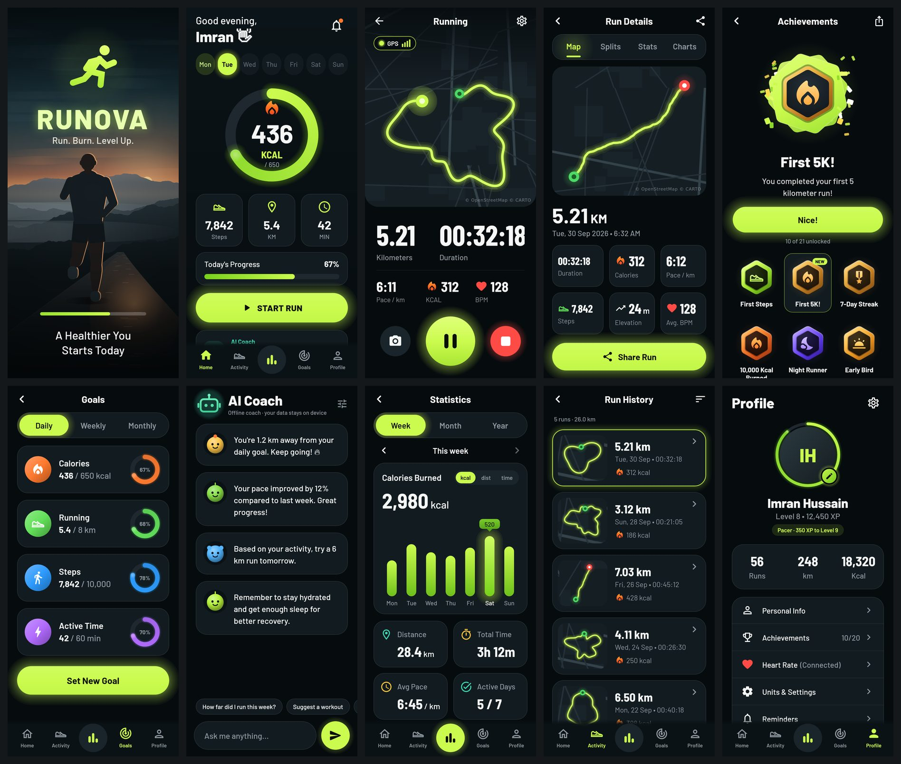

# RUNOVA — Run. Burn. Level Up.

RUNOVA is an Android running app with GPS tracking, a live route map, calorie and step estimates, goals, XP and levels, streaks, achievements and an AI coach that works offline and can optionally use Claude. It uses a dark theme with a neon-lime accent.



<sub>Splash · Home · Running · Run Details · Achievements · Goals · AI Coach · Statistics · Run History · Profile. These are renders of the app's Compose screens produced by the desktop preview tool in `tools/ui-preview` (with sample data and a stand-in map).</sub>

## Status

| Part | State |
|---|---|
| Domain logic (`core/`): tracking, calories, steps, XP, levels, streaks, achievements, stats, GPX, offline coach | Done, **43 JVM tests pass** |
| Claude coach client (`claude/`) on the official Anthropic Java SDK | Done, **9 tests pass** against a local fake API |
| Screen state mapping, live-run texts, heart-rate parsing (`app/src/shared/.../state`) | Done, **14 JVM tests pass** |
| All Compose screens (`app/src/shared/.../ui`) | Done; compile and render on the JVM (Compose Desktop) |
| Android layer (`app/src/main`): SQLite, tracking service, sensors, BLE, TTS, notifications, navigation | Written; **not compiled yet** |
| Robolectric flow tests (`app/src/test`) | Written; **not run yet** |
| `RUNOVA.apk` | **Not built yet** |

The build machine used so far cannot reach Google's Maven repository (`dl.google.com` / `maven.google.com`), which hosts the Android Gradle Plugin and AndroidX. Everything that doesn't depend on those artifacts has been compiled and tested. Once the host is reachable, the next steps are: compile the app module, fix any compile errors, run the unit, Robolectric and lint checks, then build the signed release APK.

## Features

**Run tracking**
- GPS tracking in a foreground service (type `location`), so it keeps running with the screen off. A partial wake lock and 1 s GPS updates are used.
- Live route map (OpenStreetMap data via CARTO basemaps) with follow mode, pinch-zoom and start/current markers.
- Distance, timer, current pace (20 s window, smoothed) and average pace.
- Pause and resume. Resuming starts a new route segment, and time spent paused never counts.
- Optional auto-pause: the run pauses when you stop and resumes when you move.
- GPS filtering:
  - Rejects fixes with poor accuracy (> 30 m).
  - Speed-spike filter that re-anchors after persistent spikes.
  - Jitter gate that uses Doppler speed, so standing still adds no distance.
  - Smoothed elevation with hysteresis.
- Splits every km or mile, with a spoken announcement and an on-screen toast.
- 3-second countdown (optional) while GPS warms up.
- Heart rate from any Bluetooth LE strap or watch that exposes the standard Heart Rate service (0x180D). It reconnects automatically after drop-outs.
- Steps from the hardware step counter when available, otherwise estimated from distance, speed and height (marked as an estimate).
- Photos during a run (camera app via `TakePicture`).
- Ongoing notification with live distance, time and pace, plus Pause/Resume actions.
- Crash recovery:
  - The run is checkpointed to SQLite every 5 s and on every pause or resume.
  - If the process dies, the next launch offers to resume, save or discard it.

**After the run**
- An animated summary counts up distance, time, pace and calories.
- It then shows the XP lines, the level bar (with a level-up badge and confetti), unlocked achievements and completed goals.
- Run details has four tabs: Map, Splits, Stats and Charts (pace, elevation and heart rate).
- Share a rendered 1080×1350 run card, export GPX, or delete the run.

**Progress**
- Stats by week, month and year for calories, distance or time. You can page back through earlier periods, and each view shows total time, average pace and active days.
- Daily figures (calories, steps, distance, active minutes) appear on Home for any day of the week.
- Goals:
  - Daily, weekly and monthly targets for calories, distance, steps and active minutes, all editable.
  - Each goal pays XP once per period: 30 (daily), 100 (weekly) or 300 (monthly).
- XP:
  - 50 XP per km, 2 XP per active minute.
  - +25 for the first run of the day, +50 for 5 km+.
  - Streak bonus of 5 XP per streak day (max 50).
  - Achievement XP.
- Levels: level *L* needs 200·(L−1)² XP in total, with titles Rookie → Jogger → Runner → Pacer → Racer → Elite → Legend.
- Streaks: a day counts with a run of ≥ 0.5 km or ≥ 5 min. The current and longest streak are both tracked.
- 21 achievements:
  - First Steps, First 5K!, 10K Club, Half Marathon, Marathon Legend.
  - Hat Trick, 7-Day Streak, Unstoppable, Century, Road Warrior.
  - Getting Serious, Dedicated, 10,000 Kcal Burned, Night Runner, Early Bird.
  - Speed Demon, Hill Climber, Hour of Power, Goal Crusher, Weekend Warrior, Level 10.
- In-app notification inbox for achievements, level-ups, goals and saved runs. The same news also comes as system notifications when it happens in the background.
- Optional daily reminder (inexact alarm, no special permission). It is skipped if you already ran that day.

**AI Coach**
- The offline rule-based coach always works. Examples of its insights:
  - "You're 1.2 km away from your daily goal. Keep going! 🔥"
  - Pace trends against last week, the remaining distance for the weekly goal, and a suggested next run.
  - Streak and level nudges, and recovery tips.
- It answers free-text questions about your own data ("How far did I run this week?", "Suggest a workout"…).
- **Optional Claude answers.** Add an Anthropic API key under *Profile → Units & Settings → AI Coach*.
  - The key is encrypted with an AES-GCM key from the Android Keystore and never leaves the device except in requests to Anthropic.
  - The default model is **Claude Opus 5.5**; Sonnet 5.5 and Haiku 4.5 are selectable.
  - Requests use low effort for fast replies. For Opus and Sonnet, Anthropic's **server-side refusal fallbacks** are switched on (`fallbacks: "default"`), so a request declined by a safety classifier is retried on Anthropic's recommended fallback model.
  - Each request sends a compact summary of your runs, goals and progress, plus the last 20 chat messages.
  - The offline coach answers instead when there's no key, no connection or an API error, or when Claude declines. A short note says why.
  - *Test connection* checks the key via the Models API, which spends no tokens.

**Profile & settings**
- Personal info (name, age, sex, height and weight, which feed the calorie and stride estimates) and a profile photo from the system photo picker.
- Metric or imperial units everywhere.
- Voice feedback, auto-pause, keep screen on and countdown toggles. The first three can also be changed mid-run from the run screen.
- Dark, light or system theme. The map style follows the theme or can be pinned to dark or light.
- Export all runs as a zip of GPX files. Delete all data.

## Estimates

Calories are **estimates**:
- They use the ACSM metabolic equations (walking below 8 km/h, running above), integrated over every GPS segment with its grade, and your weight.
- One litre of O₂ counts as 5 kcal.
- Real expenditure depends on fitness, running economy and terrain.
- Everyday steps outside runs add an estimated net walking burn.

Steps come from the hardware step counter when the device has one and activity-recognition permission is granted. Otherwise they are estimated from stride length (a function of height and speed) and marked as estimated.

## Permissions

| Permission | Why |
|---|---|
| Precise location (while in use) | GPS tracking during a run, via a foreground service started from the app. No background location. |
| Physical activity | Step counter |
| Notifications | Live run notification, achievements and reminders |
| Bluetooth scan/connect | Heart-rate straps (scan is flagged `neverForLocation`) |
| Internet | Map tiles and the optional Claude coach |

Denied permissions are handled:
- Starting a run without location explains why it's needed. If it was permanently denied, it links to the app's settings.
- Location services switched off leads to the system location settings.
- A run without step or notification permission still works.

## Privacy

Runs, routes, photos, settings and the chat history stay in the app's private storage.
- **Map tiles:** coordinates of the visible tiles are requested from CARTO's tile servers.
- **Claude (if you add a key):** your questions and a summary of your training data go to Anthropic.
- Nothing else leaves the device. Android auto-backup covers settings and the database but excludes the encrypted API key.

## Project structure

```
core/                 Pure Kotlin domain logic, JVM unit tests
claude/               Claude coach client (official Anthropic Java SDK) + offline fallback, tests with a fake API
app/src/shared/       Platform-independent Compose UI: theme, components, screens, screen-state mapping
app/src/main/         Android: SQLite, settings, Keystore, tracking service, sensors, BLE, TTS,
                      notifications, reminders, map tiles, sharing, ViewModels, navigation
app/src/test/         Robolectric flow tests (run tracking, pause/resume, save, recovery, reset)
tools/ui-preview/     Compose Desktop harness: renders the shared screens to PNG; state-mapping tests
tools/dev/            JVM-only build for running the core and claude tests without the Android SDK
```

Key choices:
- The shared screens compile both for Android and for Compose Desktop 1.5, which is how they were reviewed against the design without a device.
- Storage uses the framework SQLite and SharedPreferences, with no annotation processing.
- The map is a small custom slippy-map renderer with memory and disk tile caches, so the app needs no Google Play Services.

## Building

Requirements: JDK 17+, Android SDK with platform 36, and network access to Google Maven and Maven Central.

```bash
./gradlew :app:assembleRelease      # app/build/outputs/apk/release/app-release.apk
./gradlew :app:testDebugUnitTest    # Robolectric flow tests
./gradlew :core:test :claude:test   # domain and coach tests
```

Release signing:
- Create `keystore.properties` in the project root with `storeFile`, `storePassword`, `keyAlias` and `keyPassword`.
- It is git-ignored. Without it, the release build is signed with the debug key so it still installs.
- Releases are shrunk with R8. The Anthropic SDK ships its own keep rules.
- The SDK (with Jackson and OkHttp) is the largest dependency in the APK.

JVM-only checks that need no Android SDK:

```bash
gradle -p tools/dev :core:test :claude:test
gradle -p tools/ui-preview test
gradle -p tools/ui-preview run -Pscreens=home,running,stats   # PNGs in tools/ui-preview/build/previews
```

## Credits

- Barlow typeface by The Barlow Project Authors, SIL Open Font License 1.1 (`app/src/main/assets/licenses/barlow-ofl.txt`).
- Map data © OpenStreetMap contributors; basemaps © CARTO.
- Calorie equations: ACSM's Guidelines for Exercise Testing and Prescription.
