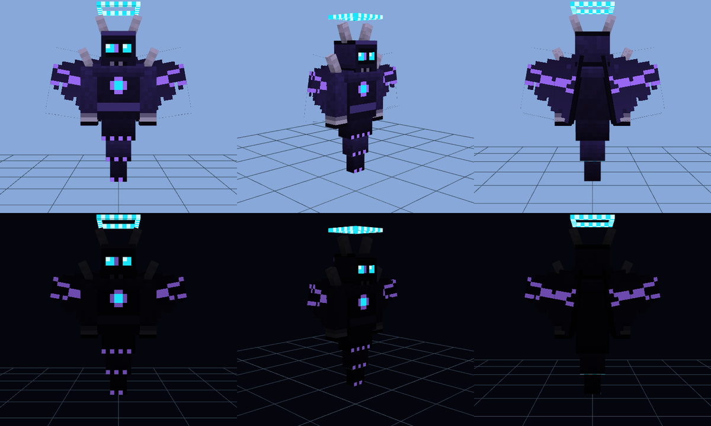

# Shadow Guardian - Minecraft Bedrock add-on

A flying, glowing-eyed bodyguard for **Minecraft Bedrock 1.21.0** (also works on the 1.21.0.26 beta).
Get it from a spawn egg, tame it with a **nether star or a diamond**, and it protects you.

* Flies and follows you everywhere. If you get far away, it teleports to you.
* Attacks hostile mobs near you and any mob that hits you.
  It **never** attacks you, your pets or villagers.
* Calls lightning on enemies and heals itself slowly.
* Special attack: a **nuclear-style explosion** (fire + shockwave). It can never hurt you.
* 500 hearts of health. Immune to fire, fall damage and explosions.
* **Sneak + tap** it to make it stay. Tap it again to make it follow.

## What it looks like

`preview.png` and `preview_poses.png` are renders of the real model and texture made with a small
3D viewer (they are not in-game screenshots). The eyes, chest rune, halo and wing veins glow in the dark.



## Files

```
shadow-guardian-addon/
├── ShadowGuardian.mcaddon          <- import this file into Minecraft
├── preview.png, preview_poses.png  pictures of the model
├── ShadowGuardian_BP/              Behavior pack (how it acts)
│   ├── manifest.json
│   ├── pack_icon.png
│   ├── entities/shadow_guardian.json
│   └── scripts/main.js             <- the SETTINGS are at the top of this file
├── ShadowGuardian_RP/              Resource pack (how it looks)
│   ├── manifest.json
│   ├── pack_icon.png
│   ├── entity/shadow_guardian.entity.json
│   ├── models/entity/shadow_guardian.geo.json
│   ├── animations/shadow_guardian.animation.json
│   ├── render_controllers/shadow_guardian.render_controllers.json
│   ├── textures/entity/shadow_guardian/shadow_guardian.png   (64 x 64)
│   └── texts/en_US.lang, languages.json
└── tools/
    ├── generate_assets.py          makes the texture, model and icons
    └── build_mcaddon.py            zips both packs into the .mcaddon
```

## Install on Android

1. Download `ShadowGuardian.mcaddon` to your phone.
2. Tap the file (open it with **Minecraft**). Wait for "Successfully imported".
3. Open Minecraft, make a new world (or edit an old one).
4. Open **Add-ons**:
   * **Behavior Packs** -> *Shadow Guardian BP* -> **Activate**
   * **Resource Packs** -> *Shadow Guardian RP* -> **Activate** (it may turn on by itself)
5. **Experiments: leave everything OFF.** No "Beta APIs" switch is needed.
6. Turn **Cheats** on if you want the commands below. Create the world.

## Play

1. Get the egg: open the Creative inventory, search **shadow**, or type
   `/give @s sg:shadow_guardian_spawn_egg`.
2. Place the egg. Hold a **nether star** (or **diamond**) and tap the guardian to tame it.
3. Sneak + tap = stay. Tap again = follow.
4. Test the nuke: `/scriptevent sg:nuke` (it blasts the spot you look at).
5. Spawn without an egg: `/summon sg:shadow_guardian`.

## Change the settings

Open `ShadowGuardian_BP/scripts/main.js` in any text editor. The first lines are the settings:

```js
const EXPLOSION_SIZE = 15;   // blast radius (TNT = 4)
const BREAK_BLOCKS = true;   // false = the blast does not break blocks
```

Easy way on Android: open `ShadowGuardian.mcaddon` with **ZArchiver**, open
`ShadowGuardian_BP/scripts/main.js`, edit and save, then import the file again
(if Minecraft says the pack already exists, delete the old one in Settings -> Storage first).

## Rebuild the files

```
pip install pillow
python3 tools/generate_assets.py     # texture, model, icons
python3 tools/build_mcaddon.py       # ShadowGuardian.mcaddon
```

## Technical notes

* Script module: `@minecraft/server` **1.10.0** (stable). The script also type-checks against 1.11.0.
* `min_engine_version` is `[1, 21, 0]` in both manifests.
* Tested on a real Bedrock Dedicated Server **1.21.0.03** with a test player: taming, sneak-tap
  stay/follow, combat, friendly-fire safety, teleport, lightning, heal and the nuke.
* The glowing eyes use the vanilla material `entity_emissive_alpha` (texture alpha 3 = glow, like the Enderman).
* The guardian keeps within about 5 blocks of you, so it is easy to tap. To change that, edit
  `start_distance` (and `stop_distance`) under `minecraft:behavior.follow_owner` in `entities/shadow_guardian.json`.
