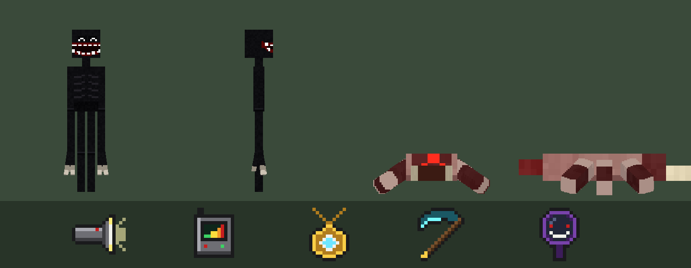

# Urban Legends Horror: Minecraft Bedrock Add-on

A horror add-on for **Minecraft Bedrock / Pocket Edition 1.21.0+** (made for Android beta 1.21.0.26).
Everything shows up in the **creative inventory**.



## Download and install (Android)

1. Download [`dist/UrbanLegendsHorror.mcaddon`](dist/UrbanLegendsHorror.mcaddon)
   (on GitHub: open the file, then tap the **download** button or **View raw**).
2. Open the downloaded file with **Minecraft** (use your Files app and tap it).
   Minecraft says *"Successfully imported Urban Legends Horror"* for both packs.
3. Create a new world, or edit an existing one. Go to **Behavior Packs**, find
   **Urban Legends Horror (Behavior)** and tap **Activate**. The resource pack is added automatically.
4. Play. You don't need to turn on any experiments.

> The file won't open? Rename it from `.mcaddon` to `.zip`, extract it, and copy
> `UrbanLegends_BP` into `games/com.mojang/behavior_packs` and `UrbanLegends_RP` into
> `games/com.mojang/resource_packs`.

## What's inside

### Spawn eggs (creative inventory → Spawn Eggs)

| Mob | What it does |
| --- | --- |
| **The Grinning Man** (black egg with white spots) | An urban legend: a 3-block-tall shadow with a glowing smile that's far too wide. **He only moves when nobody is looking at him.** If you look away, he creeps closer or teleports right behind you. If you turn around and he's close, you get a jumpscare. If you hit him, he may blink behind you. You hear heartbeats and whispers when he's near. 80 HP, hits hard. Drops ender pearls, echo shards and sometimes the Soul Scythe. |
| **Parasite** (flesh-coloured egg with red spots) | A small, pale, many-legged parasite. **When it's spawned from your inventory it leaps into your head and kills you instantly**, even in Creative mode. If nobody is close, it waits for the first player who comes within 16 blocks. |

### Horror gear (creative inventory → Equipment)

| Item | How to use |
| --- | --- |
| **Flashlight** | Hold it to get night vision. Tap/use it to shine a beam that burns The Grinning Man (damage + freezes him for 3 s) and destroys parasites. |
| **EMF Ghost Reader** | Hold it to see a signal meter and hear beeps. The closer a horror mob is, the faster it beeps. Tap/use it to scan: it tells you what is out there, how far away, and which direction (*"BEHIND YOU"*). |
| **Holy Talisman** | Tap/use it for a holy shockwave. It knocks back and damages monsters, destroys parasites and **banishes** The Grinning Man far away. Also gives Regeneration and Resistance. 20 s recharge. |
| **Soul Scythe** | A weapon (9 damage). Every hit heals you, it does extra damage to horror mobs, and each kill gives you Strength. |
| **Haunted Mirror** | Like Bloody Mary: use it **three times** to call The Grinning Man. He appears right behind you. |

All the gear can also be crafted in survival (open the recipe book, or see `UrbanLegends_BP/recipes`).

**Tip:** the Parasite really kills you. In survival, run `/gamerule keepinventory true` first if you don't want to lose your items.

## For builders

```
UrbanLegends_BP/   behavior pack: mobs, items, recipes, loot, scripts (@minecraft/server 1.10.0)
UrbanLegends_RP/   resource pack: models, animations, textures, names
tools/             texture generators, preview renderer, validator and packager
```

To rebuild after changing something (you need Python 3 and Pillow):

```sh
python3 tools/make_entity_textures.py   # entity textures + pack icons
python3 tools/make_item_textures.py     # item icons
python3 tools/render_preview.py         # preview.png
python3 tools/build.py                  # validates the packs, then writes dist/UrbanLegendsHorror.mcaddon
```
